# Family Assistant Architecture Diagram

> **Note**: For detailed information about the LLM agent system and service profiles, see
> [AGENTS.md](./AGENTS.md).

## Backend Component Architecture

```mermaid
graph TB
    %% Entry Points
    subgraph "Entry Points"
        CLI["CLI Entry Point<br/>(__main__.py)"]
        WebUI["Web UI<br/>(React SPA)"]
        TG["Telegram Bot"]
        EMAIL["Email Webhook"]
    end

    %% Configuration Layer
    subgraph "Configuration"
        CONFIG["Config Loader<br/>• Hierarchical config<br/>• Service profiles<br/>• Environment vars"]
    end

    %% Core Orchestration
    subgraph "Core Orchestration"
        ASSISTANT["Assistant<br/>• Dependency injection<br/>• Service lifecycle<br/>• Resource management"]
    end

    %% Processing Layer
    subgraph "Processing Layer"
        PROC["ProcessingService<br/>• LLM orchestration<br/>• Context aggregation<br/>• Tool execution<br/>• Message history"]
        
        subgraph "Service Profiles"
            PROF1["Default Profile<br/>• Full tools<br/>• Main LLM"]
            PROF2["Browser Profile<br/>• Browser tools only<br/>• Specialized LLM"]
            PROF3["Research Profile<br/>• No tools<br/>• Research LLM"]
        end
    end

    %% Context System
    subgraph "Context Providers"
        CTX_NOTES["Notes Context"]
        CTX_CAL["Calendar Context"]
        CTX_WEATHER["Weather Context"]
        CTX_HA["Home Assistant Context"]
        CTX_USERS["Known Users Context"]
    end

    %% Tool System
    subgraph "Tool System"
        TOOLS["CompositeToolsProvider"]
        
        subgraph "Tool Providers"
            LOCAL["LocalToolsProvider<br/>• Python functions<br/>• Dependency injection"]
            MCP["MCPToolsProvider<br/>• External servers<br/>• Protocol integration"]
            FILTERED["FilteredToolsProvider<br/>• Profile restrictions"]
            CONFIRM["ConfirmingToolsProvider<br/>• User confirmation"]
        end
        
        subgraph "Tool Categories"
            T_NOTES["Notes Tools"]
            T_TASKS["Task Tools"]
            T_DOCS["Document Tools"]
            T_CAL["Calendar Tools"]
            T_COMM["Communication Tools"]
            T_HA_TOOLS["Home Assistant Tools"]
            T_EVENTS["Event Tools"]
        end
    end

    %% Storage Layer
    subgraph "Storage Layer"
        DB_CTX["DatabaseContext<br/>• Transaction management<br/>• Connection pooling<br/>• Retry logic"]
        
        subgraph "Repositories"
            R_NOTES["NotesRepository"]
            R_TASKS["TasksRepository"]
            R_MSG["MessageHistoryRepository"]
            R_EMAIL["EmailRepository"]
            R_EVENTS["EventsRepository"]
            R_VECTOR["VectorRepository"]
            R_ERROR["ErrorLogsRepository"]
        end
        
        subgraph "Database"
            SQLITE["SQLite<br/>(Development)"]
            POSTGRES["PostgreSQL<br/>(Production)"]
        end
    end

    %% Task System
    subgraph "Task Worker System"
        WORKER["TaskWorker<br/>• Queue polling<br/>• Handler execution<br/>• Retry logic"]
        
        subgraph "Task Handlers"
            H_LLM["LLM Callback"]
            H_INDEX["Document Indexing"]
            H_EMBED["Embedding Generation"]
            H_SCRIPT["Script Execution"]
            H_MAINT["System Maintenance"]
        end
    end

    %% Event System
    subgraph "Event System"
        EVENT_PROC["EventProcessor<br/>• Event routing<br/>• Listener matching<br/>• Action execution"]
        
        subgraph "Event Sources"
            E_HA["Home Assistant Source<br/>(WebSocket)"]
            E_INDEX["Indexing Source"]
        end
        
        E_LISTENERS["Event Listeners<br/>• Condition matching<br/>• Rate limiting<br/>• Action triggers"]
    end

    %% Document Indexing
    subgraph "Document Indexing"
        INDEX_PIPE["IndexingPipeline<br/>• Pipeline orchestration<br/>• Processor chain"]
        
        subgraph "Processors"
            P_TEXT["Text Chunker"]
            P_LLM["LLM Intelligence"]
            P_EMBED["Embedding Dispatch"]
            P_FILE["File Processors"]
        end
        
        subgraph "Indexers"
            IDX_DOC["Document Indexer"]
            IDX_EMAIL["Email Indexer"]
            IDX_NOTE["Notes Indexer"]
        end
    end

    %% Web API Layer
    subgraph "Web API (FastAPI)"
        APP["FastAPI App<br/>• Router management<br/>• Middleware stack<br/>• SSE streaming"]
        
        subgraph "API Routers"
            API_CHAT["Chat API<br/>• Send message<br/>• SSE streaming<br/>• Conversations"]
            API_TOOLS["Tools API<br/>• Execute tools<br/>• Get definitions"]
            API_DOCS["Documents API<br/>• Upload<br/>• Search<br/>• Reindex"]
            API_NOTES["Notes API<br/>• CRUD operations"]
            API_TASKS["Tasks API<br/>• Task management"]
            API_EVENTS["Events API<br/>• Event queries<br/>• Listener management"]
        end
        
        CONFIRM_MGR["ConfirmationManager<br/>• Tool confirmations<br/>• SSE-based flow"]
    end

    %% LLM Integration
    subgraph "LLM Integration"
        LLM["LLMInterface<br/>• Model abstraction<br/>• Streaming support<br/>• Tool calling"]
        
        subgraph "LLM Backends"
            LLM_OPENAI["OpenAI"]
            LLM_ANTHROPIC["Anthropic"]
            LLM_GEMINI["Gemini"]
            LLM_LOCAL["Local Models"]
        end
    end

    %% Connections - Entry to Core
    CLI --> CONFIG
    CONFIG --> ASSISTANT
    
    %% Core to Services
    ASSISTANT --> PROC
    ASSISTANT --> WORKER
    ASSISTANT --> EVENT_PROC
    ASSISTANT --> APP
    ASSISTANT --> TG
    
    %% Web Connections
    WebUI --> APP
    EMAIL --> APP
    TG --> PROC
    
    %% Processing Connections
    PROC --> PROF1
    PROC --> PROF2
    PROC --> PROF3
    PROC --> LLM
    PROC --> TOOLS
    PROC --> DB_CTX
    
    %% Context Provider Connections
    PROC --> CTX_NOTES
    PROC --> CTX_CAL
    PROC --> CTX_WEATHER
    PROC --> CTX_HA
    PROC --> CTX_USERS
    
    %% Tool System Connections
    TOOLS --> LOCAL
    TOOLS --> MCP
    LOCAL --> FILTERED
    FILTERED --> CONFIRM
    LOCAL --> T_NOTES
    LOCAL --> T_TASKS
    LOCAL --> T_DOCS
    LOCAL --> T_CAL
    LOCAL --> T_COMM
    LOCAL --> T_HA_TOOLS
    LOCAL --> T_EVENTS
    
    %% Database Connections
    DB_CTX --> R_NOTES
    DB_CTX --> R_TASKS
    DB_CTX --> R_MSG
    DB_CTX --> R_EMAIL
    DB_CTX --> R_EVENTS
    DB_CTX --> R_VECTOR
    DB_CTX --> R_ERROR
    
    R_NOTES --> SQLITE
    R_NOTES --> POSTGRES
    R_TASKS --> SQLITE
    R_TASKS --> POSTGRES
    R_MSG --> SQLITE
    R_MSG --> POSTGRES
    R_EMAIL --> SQLITE
    R_EMAIL --> POSTGRES
    R_EVENTS --> SQLITE
    R_EVENTS --> POSTGRES
    R_VECTOR --> SQLITE
    R_VECTOR --> POSTGRES
    R_ERROR --> SQLITE
    R_ERROR --> POSTGRES
    
    %% Task Worker Connections
    WORKER --> R_TASKS
    WORKER --> H_LLM
    WORKER --> H_INDEX
    WORKER --> H_EMBED
    WORKER --> H_SCRIPT
    WORKER --> H_MAINT
    
    %% Event System Connections
    EVENT_PROC --> E_HA
    EVENT_PROC --> E_INDEX
    EVENT_PROC --> E_LISTENERS
    EVENT_PROC --> R_EVENTS
    E_LISTENERS --> WORKER
    
    %% Indexing Connections
    INDEX_PIPE --> P_TEXT
    INDEX_PIPE --> P_LLM
    INDEX_PIPE --> P_EMBED
    INDEX_PIPE --> P_FILE
    IDX_DOC --> INDEX_PIPE
    IDX_EMAIL --> INDEX_PIPE
    IDX_NOTE --> INDEX_PIPE
    P_EMBED --> WORKER
    INDEX_PIPE --> E_INDEX
    
    %% API Router Connections
    APP --> API_CHAT
    APP --> API_TOOLS
    APP --> API_DOCS
    APP --> API_NOTES
    APP --> API_TASKS
    APP --> API_EVENTS
    API_CHAT --> PROC
    API_CHAT --> CONFIRM_MGR
    API_TOOLS --> TOOLS
    API_DOCS --> IDX_DOC
    API_NOTES --> R_NOTES
    API_TASKS --> R_TASKS
    API_EVENTS --> R_EVENTS
    
    %% LLM Backend Connections
    LLM --> LLM_OPENAI
    LLM --> LLM_ANTHROPIC
    LLM --> LLM_GEMINI
    LLM --> LLM_LOCAL

    %% Styling
    classDef entryPoint fill:#e1f5e1,stroke:#4caf50,stroke-width:2px
    classDef core fill:#fff3e0,stroke:#ff9800,stroke-width:2px
    classDef storage fill:#e3f2fd,stroke:#2196f3,stroke-width:2px
    classDef processing fill:#fce4ec,stroke:#e91e63,stroke-width:2px
    classDef tool fill:#f3e5f5,stroke:#9c27b0,stroke-width:2px
    classDef api fill:#e8f5e9,stroke:#4caf50,stroke-width:2px
    classDef event fill:#fff9c4,stroke:#fbc02d,stroke-width:2px
    classDef index fill:#efebe9,stroke:#795548,stroke-width:2px
    
    class CLI,WebUI,TG,EMAIL entryPoint
    class ASSISTANT,CONFIG core
    class DB_CTX,R_NOTES,R_TASKS,R_MSG,R_EMAIL,R_EVENTS,R_VECTOR,R_ERROR,SQLITE,POSTGRES storage
    class PROC,PROF1,PROF2,PROF3,LLM,LLM_OPENAI,LLM_ANTHROPIC,LLM_GEMINI,LLM_LOCAL processing
    class TOOLS,LOCAL,MCP,FILTERED,CONFIRM,T_NOTES,T_TASKS,T_DOCS,T_CAL,T_COMM,T_HA_TOOLS,T_EVENTS tool
    class APP,API_CHAT,API_TOOLS,API_DOCS,API_NOTES,API_TASKS,API_EVENTS,CONFIRM_MGR api
    class EVENT_PROC,E_HA,E_INDEX,E_LISTENERS event
    class INDEX_PIPE,P_TEXT,P_LLM,P_EMBED,P_FILE,IDX_DOC,IDX_EMAIL,IDX_NOTE index
```

## Data Flow Diagrams

### 1. User Message Processing Flow

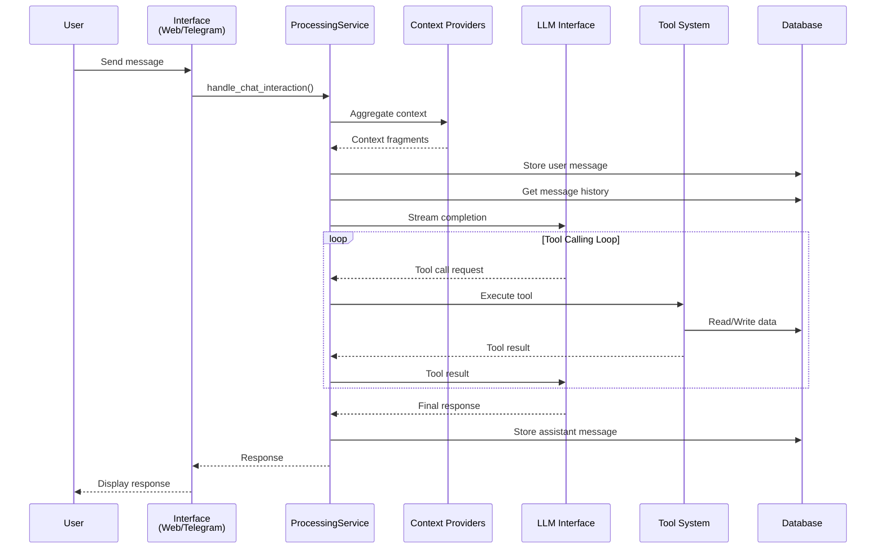

### 2. Task Processing Flow

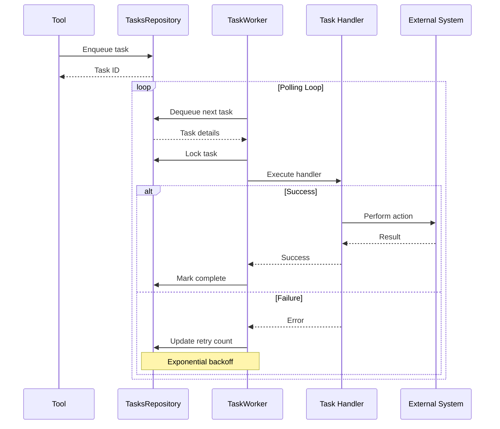

### 3. Document Indexing Flow

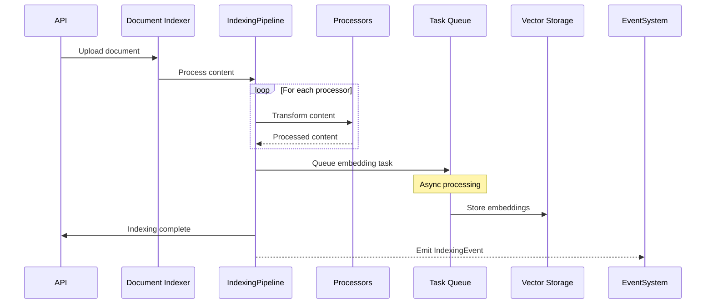

### 4. Event Processing Flow

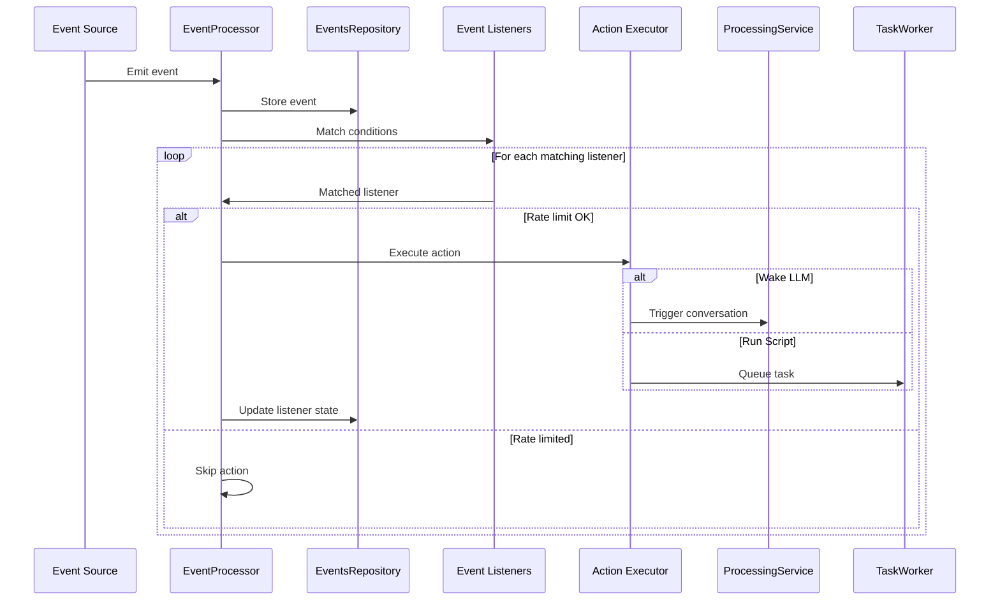

## Key Architectural Patterns

### Repository Pattern

- All data access through `DatabaseContext`
- Each repository handles specific domain
- Consistent error handling and retry logic
- Transaction management at context level

### Dependency Injection

- Constructor-based injection throughout
- Protocol-based interfaces for testing
- Configuration-driven service creation
- Shared resource management

### Event-Driven Architecture

- Loosely coupled components
- Asynchronous event processing
- Rate limiting and deduplication
- Action-based responses

### Pipeline Processing

- Configurable processor chains
- Content transformation stages
- Async task dispatching
- Error handling at each stage

### Service Profiles

- Multiple LLM configurations
- Tool access control per profile
- Context provider customization
- Delegation between profiles

## Technology Stack

### Core Technologies

- **Language**: Python 3.11+
- **Web Framework**: FastAPI
- **Database ORM**: SQLAlchemy 2.0
- **Async Runtime**: asyncio
- **Frontend**: React + Vite
- **Task Queue**: Custom database-backed

### Storage

- **Development**: SQLite with optimizations
- **Production**: PostgreSQL with pgvector
- **Migrations**: Alembic
- **Caching**: In-memory + database

### External Integrations

- **LLM Providers**: OpenAI, Anthropic, Gemini
- **Home Automation**: Home Assistant WebSocket
- **Calendar**: CalDAV protocol
- **Email**: Mailgun webhooks
- **Weather**: WillyWeather API
- **Tools**: MCP (Model Context Protocol)

### Development Tools

- **Testing**: pytest + pytest-asyncio
- **UI Testing**: Playwright
- **Linting**: ruff, basedpyright, pylint
- **Formatting**: ruff format
- **Documentation**: Markdown + Mermaid

## Additional Component Interaction Flows

### 5. Service Startup Flow

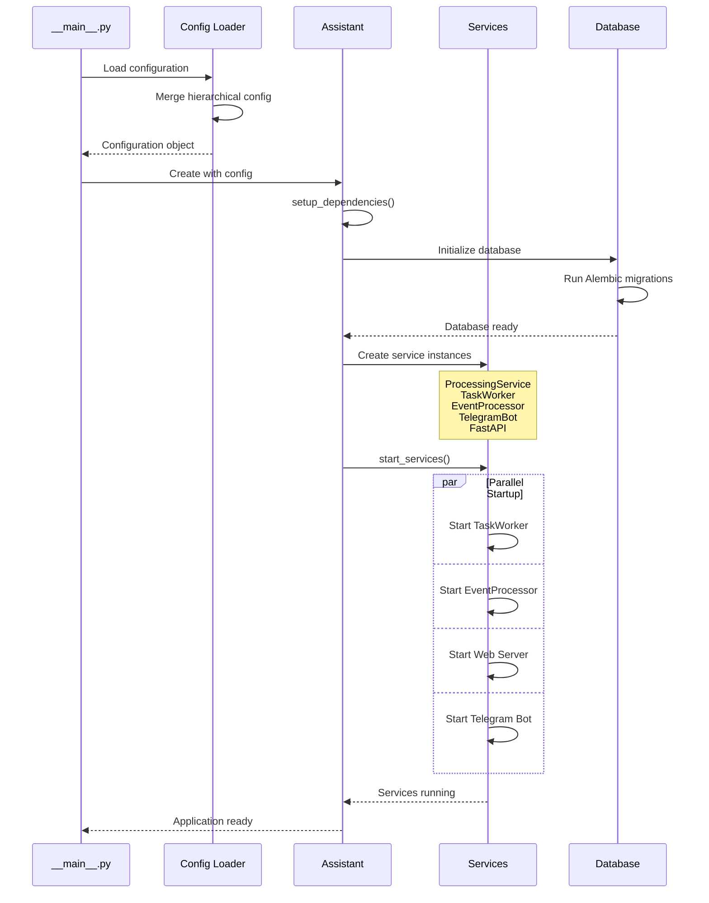

### 6. Tool Confirmation Flow

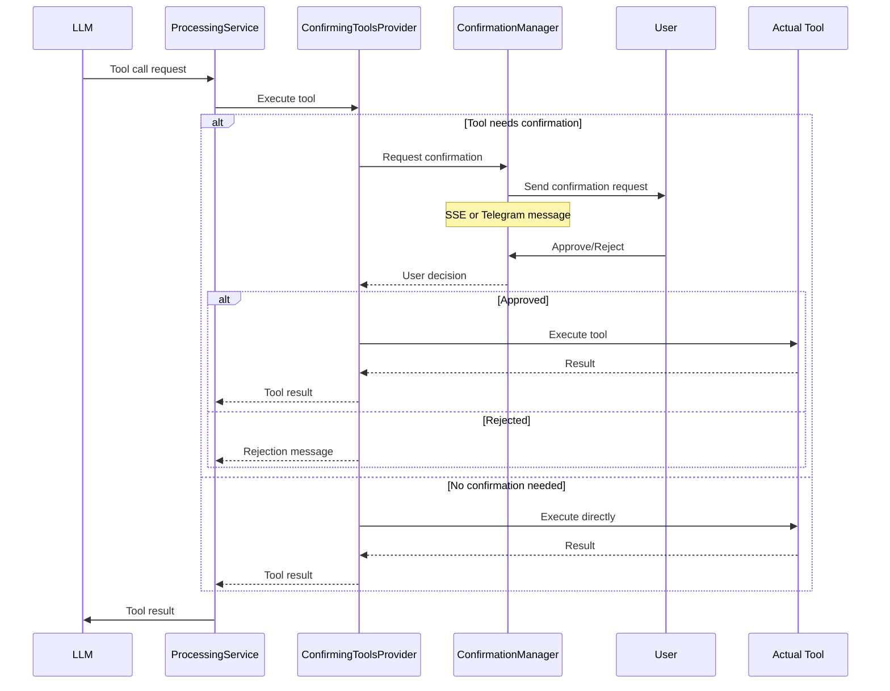

### 7. Profile Delegation Flow

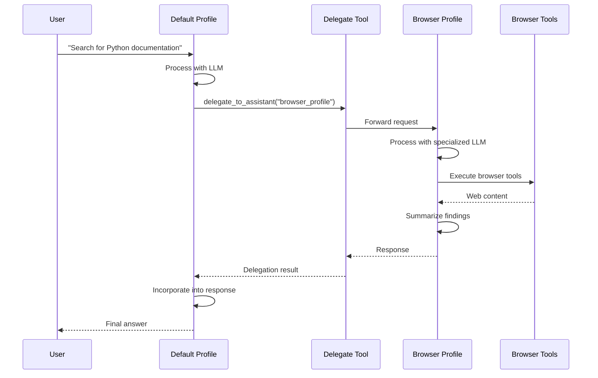

### 8. Database Transaction Flow

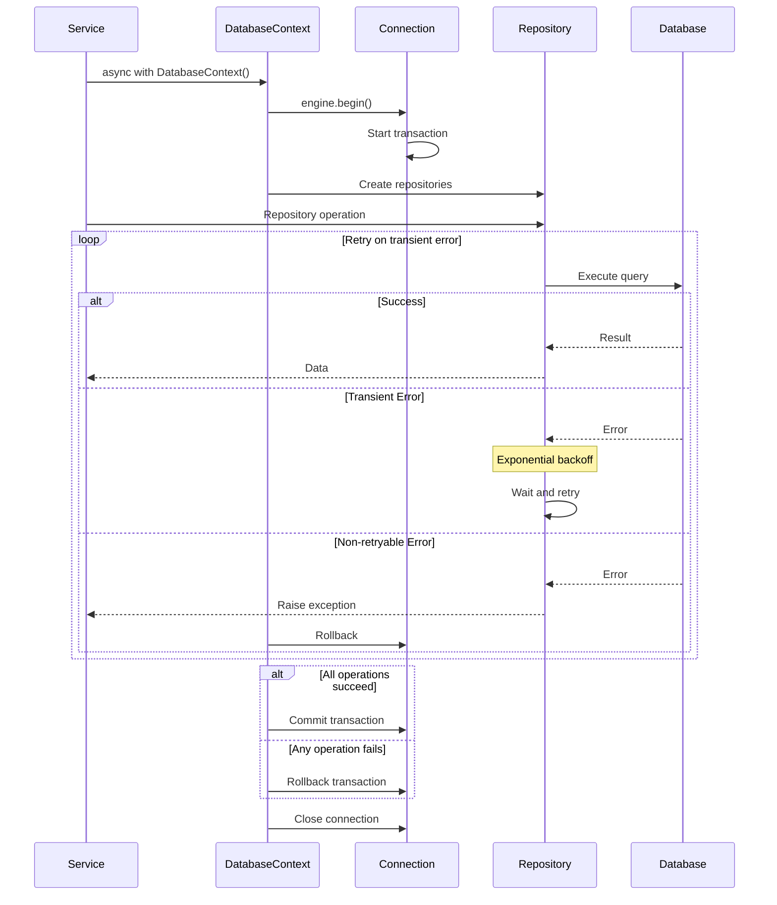

### 9. Real-time Streaming Flow (SSE)

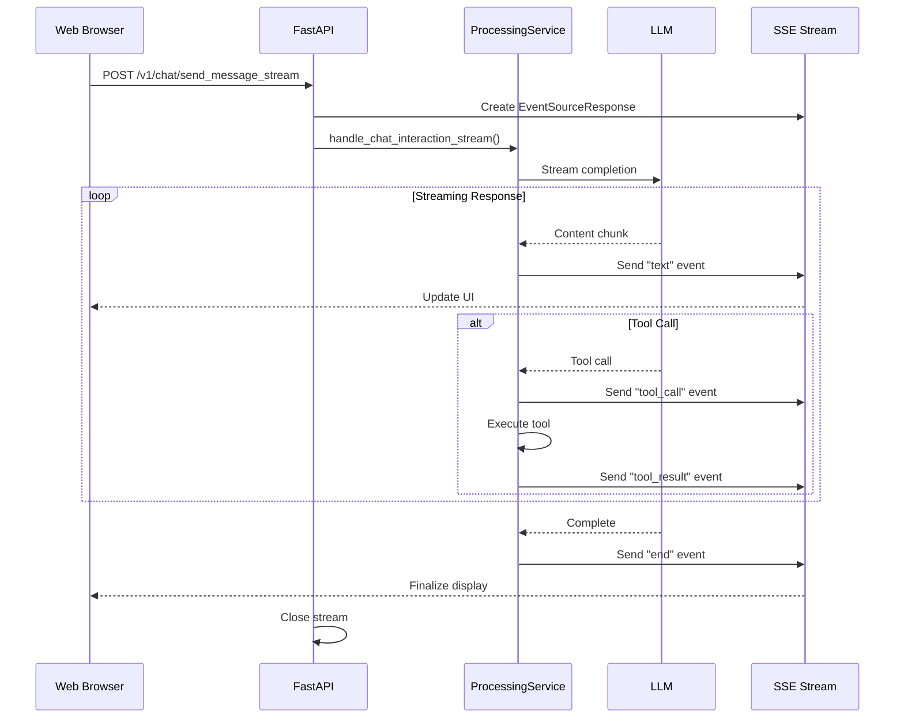

### 10. Home Assistant Integration Flow

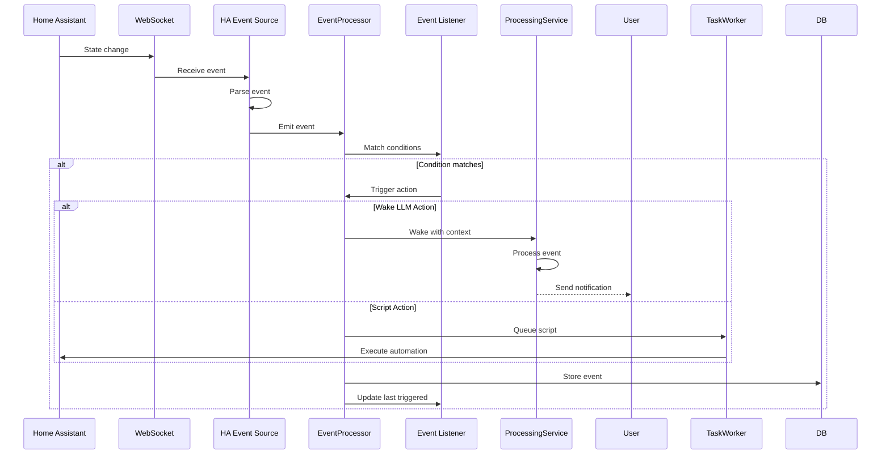

## Component Responsibilities Summary

### Core Components

| Component             | Primary Responsibilities                                        | Key Interactions                                  |
| --------------------- | --------------------------------------------------------------- | ------------------------------------------------- |
| **Assistant**         | Service lifecycle, dependency injection, resource management    | All services, Database, Configuration             |
| **ProcessingService** | LLM orchestration, context aggregation, tool execution          | LLM providers, Tools, Context providers, Database |
| **DatabaseContext**   | Transaction management, repository access, connection pooling   | All repositories, Database engines                |
| **TaskWorker**        | Background job processing, scheduling, retry logic              | Task handlers, Database, Services                 |
| **EventProcessor**    | Event routing, listener matching, action execution              | Event sources, Database, Task system              |
| **IndexingPipeline**  | Document processing, content transformation, embedding dispatch | Processors, Task queue, Vector storage            |

### Repository Responsibilities

| Repository                   | Data Domain              | Key Operations                         |
| ---------------------------- | ------------------------ | -------------------------------------- |
| **NotesRepository**          | User notes and knowledge | CRUD, prompt inclusion, search         |
| **TasksRepository**          | Background tasks         | Queue management, scheduling, retries  |
| **MessageHistoryRepository** | Conversation history     | Thread management, turn grouping       |
| **EmailRepository**          | Email storage            | Parsing, attachment handling, indexing |
| **EventsRepository**         | System events            | Event storage, listener management     |
| **VectorRepository**         | Embeddings               | Semantic search, document vectors      |
| **ErrorLogsRepository**      | Error tracking           | Logging, categorization, debugging     |

### Tool Categories

| Category           | Purpose                  | Example Tools                            |
| ------------------ | ------------------------ | ---------------------------------------- |
| **Notes**          | Knowledge management     | add_or_update_note, search_notes         |
| **Tasks**          | Scheduling and reminders | schedule_callback, create_recurring_task |
| **Documents**      | Content processing       | search_documents, ingest_document        |
| **Calendar**       | Event management         | create_event, search_events              |
| **Communication**  | Messaging                | send_message, view_message_history       |
| **Events**         | System automation        | query_recent_events, manage_listeners    |
| **Home Assistant** | Home automation          | execute_service, get_state               |
