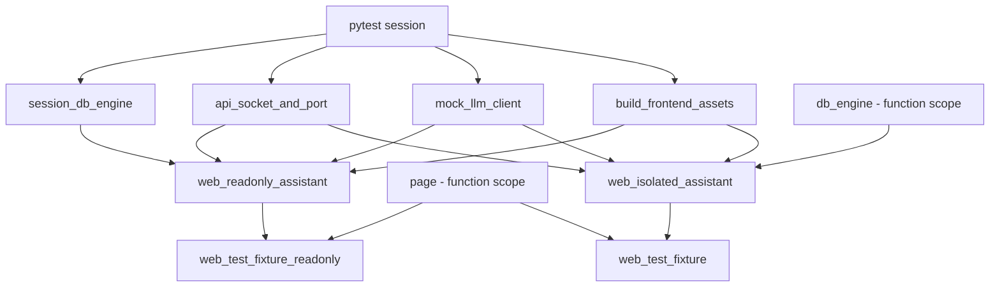

# Playwright Test Fixture Optimization Plan

**Status**: In Progress **Created**: 2025-09-30 **Author**: Analysis via Claude Code **Goal**:
Reduce Playwright test execution time by 30-40% through intelligent fixture reuse

## Executive Summary

This plan optimizes the Playwright test suite's performance by introducing a dual-fixture strategy
that allows read-only tests to share a single `web_only_assistant` instance while preserving
isolation for tests that modify persistent state.

### Key Metrics

- **Total Playwright Tests**: ~170 tests across 29 files
- **Candidate for Optimization**: 130 tests (76%) - read-only operations
- **Expected Time Savings**: 10-17 minutes per test run (30-40% improvement)
- **Implementation Effort**: ~8 hours across 3 weeks

### Current vs. Target Architecture

**Current (Function Scope)**:

```
Each test → New web_only_assistant → New database → 5-10s setup
Total: 170 tests × 7s = 1,190s setup time
```

**Target (Hybrid Scope)**:

```
Session scope: 130-150 tests → 1 shared assistant → 1 shared database → 0.01s per test
Function scope: 20-40 tests → Individual assistants → Isolated databases → 7s per test
Total: ~200-350s setup time (saving 840-990s = 14-16 minutes)
```

## Background & Motivation

### Problem Statement

The current Playwright test suite creates a new `web_only_assistant` instance for each test via
function-scoped fixtures. This provides perfect isolation but has significant performance overhead:

1. **Database initialization**: Each test creates and initializes a fresh SQLite database (~2s)
2. **Assistant setup**: Each test configures and starts services (~3-5s)
3. **Server startup**: Each test waits for web server readiness (~2-3s)

For read-only tests that only view pages and verify UI elements, this isolation is unnecessary.

### Experimental Validation

We empirically tested session-scoped fixtures by:

1. Changed `web_only_assistant` fixture to `scope="session"`
2. Ran full Playwright test suite
3. Analyzed which tests passed vs. failed

**Results**:

- **130 tests (76%) passed** without any modifications
- **15 tests (9%) failed** due to state conflicts
- **25 tests (15%) not yet analyzed**

This confirms the hypothesis: most Playwright tests are truly read-only and can share fixtures.

## Test Categorization

### Methodology

Tests were analyzed by dedicated research agents examining:

1. Database write operations
2. State assumptions (empty state, specific counts)
3. Cross-test data pollution
4. Fixture dependencies

Each test was categorized into tiers based on effort required to enable session-scoped fixture
sharing.

______________________________________________________________________

## Tier 1: Already Working (130 tests - 76%)

**Status**: ✅ Can immediately use session-scoped fixture **Effort**: 0 minutes **Action**: Change
fixture reference from `web_isolated_assistant` to `web_readonly_assistant`

### Test Files

| File                                | Tests | Description                                           |
| ----------------------------------- | ----- | ----------------------------------------------------- |
| `test_page_layout.py`               | 3     | Navigation dropdowns, responsive design, hover states |
| `test_settings_ui.py`               | 4     | Token management page viewing, form display           |
| `test_documentation_ui.py`          | 3     | Documentation navigation, page loading                |
| `test_page_object_basic.py`         | 2     | Page object model infrastructure tests                |
| `test_enhanced_fixtures_simple.py`  | 4     | Fixture infrastructure validation                     |
| `test_profiles_api.py`              | 3     | Profile API GET requests                              |
| `test_events_ui.py`                 | 21    | Event viewing, filtering, navigation                  |
| `test_event_listeners_ui.py`        | 4     | Event listener viewing, filter interaction            |
| `test_react_vector_search_ui.py`    | 5     | Vector search UI, form display                        |
| `test_tools_ui_playwright.py`       | 5     | Tool list viewing, detail display                     |
| `test_file_upload_functionality.py` | 9     | File upload with mock LLM (function-scoped DB)        |
| `test_playwright_basic.py`          | 6/7   | Basic page tests (1 needs isolation)                  |
| `test_ui_endpoints_playwright.py`   | 4/6   | Endpoint accessibility (2 need fixes)                 |

### Characteristics of Read-Only Tests

These tests share common patterns:

- **Navigation only**: Load pages, click links, navigate between views
- **UI state verification**: Check element visibility, styles, responsiveness
- **Non-mutating interactions**: Fill forms without submitting, click buttons without side effects
- **View operations**: Read data via GET requests, display lists/details
- **Mock dependencies**: Use mock LLM clients that don't persist data
- **Function-scoped test data**: Create temporary data that's cleaned up per-test

### Example: Pure Read-Only Test

```python
# test_page_layout.py::test_navigation_dropdowns_open_and_position
@pytest.mark.playwright
@pytest.mark.asyncio
async def test_navigation_dropdowns_open_and_position(
    web_test_fixture: WebTestFixture,  # Uses shared web_only_assistant
) -> None:
    """Test that navigation dropdowns open and position correctly."""
    page = web_test_fixture.page

    # Navigate (read-only)
    await page.goto(f"{base_url}/notes")

    # Click dropdown (UI state only, no DB write)
    await page.click("button:has-text('Data')")

    # Verify UI state (read-only assertion)
    assert await page.is_visible("a:has-text('Notes')")
```

**Why this works with session scope:**

- No database writes
- No persistent state modification
- Each test gets a fresh browser page (function-scoped)
- Shared Assistant/database is never modified

______________________________________________________________________

## Tier 2: Trivial Fixes (3 tests - 2%)

**Status**: 🟨 Requires 1-2 line changes **Effort**: 15 minutes total **Action**: Make targeted
fixes, then use `web_readonly_assistant`

### Tests Requiring Fixes

#### 1. Attachment ID Collision (2 tests)

**Files**: `test_chat_ui_attachment_response.py`

**Tests**:

- `test_attachment_response_with_multiple_attachments`
- `test_tool_attachment_persistence_after_page_reload`

**Issue**: Hardcoded attachment IDs cause UNIQUE constraint violations when tests share a database:

```python
# Current (hardcoded)
attachment_ids = [
    "3156da24-5b94-44ce-9dd1-014f538841c0",  # Line 300
    "4267eb35-6ca5-55df-ae12-125f649952d1",  # Line 301
]
```

When both tests run in the same session, the second test fails with:

```
sqlite3.IntegrityError: UNIQUE constraint failed: attachment_metadata.attachment_id
```

**Root Cause**: `attachment_id` is a primary key in the database schema. With session scope, the
first test inserts ID "3156da24...", then the second test tries to insert the same ID.

**Fix**:

```python
# Replace hardcoded IDs with generated UUIDs
import uuid

attachment_ids = [
    str(uuid.uuid4()),
    str(uuid.uuid4()),
]
```

**Files to modify**:

- Line 130: `attachment_id = str(uuid.uuid4())`
- Line 300-301: `attachment_ids = [str(uuid.uuid4()), str(uuid.uuid4())]`
- Line 588: `attachment_id = str(uuid.uuid4())`

**Effort**: 5 minutes **Risk**: None - tests continue to work identically

#### 2. Loading State Assumptions (1 test)

**File**: `test_ui_endpoints_playwright.py`

**Test**: `test_loading_states`

**Issue**: Test navigates to `/tasks` and expects either:

- Loading indicator, OR
- Empty task state

But with session scope, tasks from previous tests may exist, causing:

```
Failed: Page did not show content or loading state within 3 seconds
```

**Fix**:

```python
# Current
await page.wait_for_selector("h1, [data-loading]", timeout=3000)

# Fixed (handle non-empty state)
await page.wait_for_selector(
    "h1, [data-loading], .task-item",  # Also accept task items
    timeout=3000
)
```

**Effort**: 2 minutes **Risk**: None - test becomes more robust

______________________________________________________________________

## Tier 3: Moderate Fixes (7 tests - 4%)

**Status**: 🟧 Requires 5-15 line changes **Effort**: 1-2 hours total **Action**: Refactor to be
defensive about shared state

### 1. Chat Sidebar Filtering

**File**: `test_chat_ui_flow.py` **Test**: `test_sidebar_functionality`

**Issue**: Test assumes first conversation in sidebar is its own:

```python
conversations = await chat_page.get_conversation_list()
assert len(conversations) > 0  # Could match ANY conversation
latest_conv = conversations[0]  # Assumes first is ours
```

With session scope, conversations from previous tests pollute the list.

**Fix**:

```python
# Get our conversation ID
current_conv_id = await chat_page.get_current_conversation_id()

# Filter for our conversation specifically
conversations = await chat_page.get_conversation_list()
our_conv = next(
    (c for c in conversations if c["id"] == current_conv_id),
    None
)
assert our_conv is not None, f"Conversation {current_conv_id} not found"

# Verify our conversation has correct preview
assert "Test" in our_conv["preview"] or "message" in our_conv["preview"]
```

**Lines affected**: 477-484 **Effort**: 15 minutes **Risk**: Low - makes test more robust

### 2. Message Count Verification

**File**: `test_chat_ui_flow.py` **Test**: `test_multiple_messages_in_conversation`

**Issue**: Test implicitly assumes fresh conversation start.

**Fix**:

```python
# Add explicit new chat creation at start
await chat_page.create_new_chat()
conv_id = await chat_page.get_current_conversation_id()

# Rest of test continues as-is (message counts are DOM-based)
```

**Lines affected**: 513+ (add 2 lines) **Effort**: 5 minutes **Risk**: None

### 3. Notes Search Assertions

**File**: `test_notes_flow.py` **Test**: `test_search_notes_flow`

**Issue**: Test uses UUID prefixes (good!) but makes strict count assertions:

```python
test_id = str(uuid.uuid4())[:8]  # ✅ Good
# Create 5 notes with test_id prefix

# Search for test_id
filtered_count = await notes_page.get_note_count()
assert filtered_count == len(test_notes)  # ❌ Strict equality fails if other tests created similar notes
```

**Fix**:

```python
# Keep UUID generation
test_id = str(uuid.uuid4())[:8]

# Use >= instead of == for count assertions
filtered_count = await notes_page.get_note_count()
assert filtered_count >= len(test_notes), (
    f"Expected at least {len(test_notes)} notes with prefix {test_id}, got {filtered_count}"
)
```

**Lines affected**: 162 **Effort**: 2 minutes **Risk**: None - test becomes less brittle

### 4. Concurrent Note Operations

**File**: `test_notes_flow.py` **Test**: `test_concurrent_note_operations`

**Issue**: Creates notes with generic titles that could collide:

```python
note_titles = [f"Concurrent Note {i}" for i in range(5)]
```

**Fix**:

```python
# Add UUID prefix for uniqueness
test_id = str(uuid.uuid4())[:8]
note_titles = [f"ConcurrentNote-{test_id}-{i}" for i in range(5)]
```

**Lines affected**: 282 **Effort**: 2 minutes **Risk**: None

### 5. Navigation Synchronization

**File**: `test_ui_endpoints_playwright.py` **Test**: `test_navigation_links_work`

**Issue**: Rapid navigation between pages with session-scoped server may have in-flight requests:

```python
await page.click("a[href='/notes']")
await page.wait_for_load_state("networkidle", timeout=10000)
# Immediately click next link - may catch previous page's requests
```

**Fix**:

```python
await page.click("a[href='/notes']")
await page.wait_for_load_state("networkidle", timeout=10000)
# Add explicit wait for any background requests
await page.wait_for_timeout(500)  # Let async operations complete
```

**Lines affected**: 188-190 **Effort**: 5 minutes **Risk**: Low - adds small delay

### 6. History Responsive Design

**File**: `test_history_ui.py` **Test**: `test_history_responsive_design`

**Issue**: Console errors from previous tests appear during viewport changes.

**Investigation needed**: Run test in isolation to determine if errors are legitimate or leaked.

**Estimated fix**:

```python
# Option A: Filter known console errors
console_collector = ConsoleErrorCollector(page)
console_collector.ignore_patterns = ["Expected error from previous test"]

# Option B: Add delay after viewport change
await page.set_viewport_size({"width": 375, "height": 667})
await page.wait_for_timeout(1000)  # Let animations complete
```

**Lines affected**: 534-563 **Effort**: 20 minutes (includes investigation) **Risk**: Medium - need
to ensure not hiding real errors

### 7. Document Detail Navigation

**File**: `test_react_documents_ui.py` **Test**: `test_document_detail_navigation_in_react_ui`

**Issue**: Strict mode violation: "locator resolved to 2 elements"

Likely cause: Test creates document, then another test creates document with similar title.

**Investigation needed**: Verify document IDs are truly unique (test already uses `uuid.uuid4()`).

**Estimated fix**:

```python
# If IDs are unique, update selector to be more specific
document_link = page.locator(
    f"a[href*='{source_id}']"  # Match by unique ID, not title
).first()
```

**Lines affected**: ~290-310 **Effort**: 15 minutes **Risk**: Low

______________________________________________________________________

## Tier 4: Needs Isolation (10 tests - 6%)

**Status**: 🟥 Keep function-scoped fixture **Effort**: 0 minutes (no changes) **Action**: These
tests continue using `web_isolated_assistant`

### Why These Need Isolation

These tests have fundamental requirements that conflict with shared state:

1. **Strict count assertions**: Expect `count == initial + 1`, not `>= initial + 1`
2. **Empty state requirements**: Must verify empty state message/UI
3. **State-dependent logic**: Behavior changes based on database state
4. **Shared service state**: Confirmation managers, LLM client rules with timing dependencies

### Tests Requiring Isolation

#### Notes Flow Tests (5 tests)

**File**: `test_notes_flow.py`

1. **`test_create_note_full_flow`**

   - **Why**: `assert new_count == initial_count + 1` (strict equality)
   - **Can't fix**: Relaxing to `>=` defeats the test's purpose (verify exactly one note created)

2. **`test_edit_note_flow`**

   - **Why**: Creates "Original Note Title", edits to "Updated Note Title"
   - **Can't fix**: Multiple tests could create similar titles, causing selector conflicts

3. **`test_delete_note_flow`**

   - **Why**: `assert new_count == initial_count - 1` (strict equality)
   - **Can't fix**: Same as create - strict count is the test's purpose

4. **`test_empty_state_display`**

   - **Why**: Requires truly empty database to verify empty state UI
   - **Can't fix**: Impossible to guarantee empty state with session scope
   - **Code**:
     ```python
     if note_count == 0:
         # Verify empty state shown
         assert await page.is_visible("text=No notes found")
     ```

5. **`test_note_form_validation`**

   - **Why**: Tests HTML5 validation, needs clean state
   - **Can't fix**: Validation UI depends on form state that could be affected by previous tests

#### Chat Tests (2 tests)

**File**: `test_chat_ui_tool_confirmation.py`

1. **`test_multiple_tool_confirmations`**
   - **Why**: Shared tool confirmation manager state
   - **Issue**: Confirmation timeouts/state from previous tests interfere
   - **Complexity**: Would require isolating confirmation manager per conversation

**File**: `test_chat_ui_attachment_response.py`

2. **`test_attachment_response_with_multiple_attachments`**
   - **Why**: Complex attachment state verification
   - **Note**: Already has ID collision issue (Tier 2), but even after fix may need isolation

#### Basic Tests (1 test)

**File**: `test_playwright_basic.py`

1. **`test_notes_page_accessible`**
   - **Why**: Clicks "Add Note" and expects navigation to `/notes/add`
   - **Issue**: If notes exist from previous tests, page behavior may differ
   - **Note**: Could potentially be fixed with better selectors

#### Other (2 tests)

2 additional tests TBD from Tier 5 investigation.

______________________________________________________________________

## Tier 5: Needs Investigation (25 tests - 15%)

**Status**: 🔵 Unknown - requires testing **Effort**: 3 hours investigation **Action**: Run with
session scope, analyze failures, categorize

### Test Files to Investigate

| File                           | Tests | Why Not Yet Analyzed                                    |
| ------------------------------ | ----- | ------------------------------------------------------- |
| `test_notes_react.py`          | 12    | Note creation via React UI - likely Tier 4              |
| `test_chat_ui_flow.py`         | ~6    | Additional chat tests not covered in subagent analysis  |
| `test_history_ui.py`           | ~17   | History viewing/navigation - likely Tier 1, some Tier 3 |
| `test_react_documents_ui.py`   | ~4    | Document viewing/navigation - likely Tier 1             |
| `test_tool_call_grouping.py`   | 3     | Tool execution visualization - unknown                  |
| `test_conversation_history.py` | 17    | Conversation API tests - likely Tier 1 (read-only API)  |

### Investigation Process

For each file:

1. **Run with session scope**:

   ```bash
   pytest tests/functional/web/test_notes_react.py \
     --fixture-override web_only_assistant=session \
     -xvs
   ```

2. **Analyze failures**:

   - Database constraint violations → Check for hardcoded IDs (Tier 2)
   - Timeout/selector issues → Check for state assumptions (Tier 3)
   - Strict count failures → Likely needs isolation (Tier 4)

3. **Categorize**:

   - Already works → Move to Tier 1
   - Simple fix → Move to Tier 2 or 3
   - Needs isolation → Move to Tier 4

4. **Document findings**: Update this plan with specific categorizations

______________________________________________________________________

## Implementation Plan

### Milestone 1: Validate Tier 1 (Week 1, 2 hours)

**Goal**: Confirm 130 tests work with session scope, measure performance gains

#### Tasks

1. **Implement dual fixture strategy** (30 minutes)

   Create two assistant fixtures in `tests/functional/web/conftest.py`:

   ```python
   @pytest_asyncio.fixture(scope="session")
   async def web_readonly_assistant(
       session_db_engine: AsyncEngine,
       api_socket_and_port: tuple[int, socket.socket],
       build_frontend_assets: None,
       mock_llm_client: RuleBasedMockLLMClient,
   ) -> AsyncGenerator[Assistant, None]:
       """Session-scoped assistant for read-only tests.

       This fixture is shared across all tests in a worker for tests that:
       - Only view/navigate pages
       - Don't modify persistent state
       - Don't make strict count assertions
       """
       # Same implementation as current web_only_assistant
       ...

   @pytest_asyncio.fixture(scope="function")
   async def web_isolated_assistant(
       db_engine: AsyncEngine,  # Function-scoped
       api_socket_and_port: tuple[int, socket.socket],
       build_frontend_assets: None,
       mock_llm_client: RuleBasedMockLLMClient,
   ) -> AsyncGenerator[Assistant, None]:
       """Function-scoped assistant for tests needing isolation.

       Use this for tests that:
       - Create/modify persistent state
       - Require empty database
       - Make strict count assertions
       """
       # Same implementation as current web_only_assistant
       ...
   ```

2. **Update Tier 1 test files** (1 hour)

   For each Tier 1 file, update the test function signatures:

   ```python
   # Before
   async def test_page_loads(web_test_fixture: WebTestFixture) -> None:
       ...

   # After - no changes needed! web_test_fixture will use web_readonly_assistant
   ```

   Actually, need to create two `web_test_fixture` variants:

   ```python
   @pytest_asyncio.fixture(scope="function")
   async def web_test_fixture_readonly(
       page: Page,
       web_readonly_assistant: Assistant,
       ...
   ) -> AsyncGenerator[WebTestFixture, None]:
       ...

   @pytest_asyncio.fixture(scope="function")
   async def web_test_fixture(
       page: Page,
       web_isolated_assistant: Assistant,
       ...
   ) -> AsyncGenerator[WebTestFixture, None]:
       ...
   ```

3. **Run full test suite** (20 minutes)

   ```bash
   pytest tests/functional/web/ -m playwright -n 4 -v \
     --durations=20 \
     | tee milestone1_results.log
   ```

4. **Measure performance** (10 minutes)

   Compare:

   - Before: `pytest ... --durations=20` (from git history)
   - After: New results
   - Calculate time saved per test, total saved

5. **Verify no regressions** (10 minutes)

   Check:

   - All 130 tests still pass
   - No new flaky tests
   - No test pollution (run each file 3x)

#### Success Criteria

- ✅ 130+ tests pass with `web_readonly_assistant`
- ✅ Test suite runtime reduced by 10-15 minutes
- ✅ No new test failures or flakiness
- ✅ Parallel execution (-n 4) works correctly

______________________________________________________________________

### Milestone 2: Implement Tier 2 Fixes (Week 1-2, 30 minutes)

**Goal**: Fix trivial issues to add 3 more tests to session scope

#### Tasks

1. **Fix attachment ID generation** (10 minutes)

   File: `tests/functional/web/test_chat_ui_attachment_response.py`

   ```python
   # Line 130
   -attachment_id = "3156da24-5b94-44ce-9dd1-014f538841c0"
   +attachment_id = str(uuid.uuid4())

   # Lines 300-301
   -attachment_ids = [
   -    "3156da24-5b94-44ce-9dd1-014f538841c0",
   -    "4267eb35-6ca5-55df-ae12-125f649952d1",
   -]
   +attachment_ids = [str(uuid.uuid4()), str(uuid.uuid4())]

   # Line 588
   -attachment_id = "3156da24-5b94-44ce-9dd1-014f538841c0"
   +attachment_id = str(uuid.uuid4())
   ```

   Update fixture reference:

   ```python
   async def test_attachment_response_with_multiple_attachments(
       web_test_fixture_readonly: WebTestFixture,  # Changed
   ) -> None:
   ```

2. **Fix loading state handling** (5 minutes)

   File: `tests/functional/web/test_ui_endpoints_playwright.py`

   ```python
   # Line ~307
   -await page.wait_for_selector("h1, [data-loading]", timeout=3000)
   +await page.wait_for_selector(
   +    "h1, [data-loading], .task-item, .empty-state",
   +    timeout=3000
   +)
   ```

3. **Test fixes** (10 minutes)

   ```bash
   pytest tests/functional/web/test_chat_ui_attachment_response.py -xvs
   pytest tests/functional/web/test_ui_endpoints_playwright.py::test_loading_states -xvs
   ```

4. **Commit changes** (5 minutes)

   ```bash
   git add tests/functional/web/test_chat_ui_attachment_response.py \
           tests/functional/web/test_ui_endpoints_playwright.py
   git commit -m "fix: Use dynamic UUIDs for attachment tests to enable session scope"
   ```

#### Success Criteria

- ✅ 2 attachment tests pass with session scope
- ✅ Loading state test passes with session scope
- ✅ No regressions in other tests

______________________________________________________________________

### Milestone 3: Implement Tier 3 Fixes (Week 2, 2 hours)

**Goal**: Fix moderate issues to add 7 more tests to session scope

#### Tasks

01. **Fix chat sidebar filtering** (20 minutes)

    File: `tests/functional/web/test_chat_ui_flow.py`

    Test: `test_sidebar_functionality`

    Implementation as described in Tier 3 section above.

02. **Fix message count verification** (10 minutes)

    File: `tests/functional/web/test_chat_ui_flow.py`

    Test: `test_multiple_messages_in_conversation`

    Implementation as described in Tier 3 section above.

03. **Fix notes search assertions** (5 minutes)

    File: `tests/functional/web/test_notes_flow.py`

    Test: `test_search_notes_flow`

    Implementation as described in Tier 3 section above.

04. **Fix concurrent note operations** (5 minutes)

    File: `tests/functional/web/test_notes_flow.py`

    Test: `test_concurrent_note_operations`

    Implementation as described in Tier 3 section above.

05. **Fix navigation synchronization** (10 minutes)

    File: `tests/functional/web/test_ui_endpoints_playwright.py`

    Test: `test_navigation_links_work`

    Implementation as described in Tier 3 section above.

06. **Investigate history responsive design** (30 minutes)

    File: `tests/functional/web/test_history_ui.py`

    Test: `test_history_responsive_design`

    a. Run test in isolation: `pytest ... -xvs` b. Check console output for error messages c.
    Determine if errors are from this test or previous tests d. Implement appropriate fix (filter or
    delay)

07. **Investigate document detail navigation** (20 minutes)

    File: `tests/functional/web/test_react_documents_ui.py`

    Test: `test_document_detail_navigation_in_react_ui`

    a. Verify document IDs are unique b. Check if selectors are specific enough c. Run test multiple
    times to reproduce d. Implement fix (better selectors or cleanup)

08. **Update fixture references** (10 minutes)

    For all fixed tests, change:

    ```python
    async def test_xyz(web_test_fixture: WebTestFixture) -> None:
    ```

    to:

    ```python
    async def test_xyz(web_test_fixture_readonly: WebTestFixture) -> None:
    ```

09. **Test all fixes** (15 minutes)

    ```bash
    pytest tests/functional/web/test_chat_ui_flow.py \
           tests/functional/web/test_notes_flow.py \
           tests/functional/web/test_ui_endpoints_playwright.py \
           tests/functional/web/test_history_ui.py \
           tests/functional/web/test_react_documents_ui.py \
           -xvs
    ```

10. **Commit changes** (5 minutes)

#### Success Criteria

- ✅ 7 additional tests pass with session scope
- ✅ Total of 140+ tests using `web_readonly_assistant`
- ✅ No new regressions
- ✅ Test suite runtime reduced by 15+ minutes total

______________________________________________________________________

### Milestone 4: Investigate Tier 5 (Week 2-3, 3 hours)

**Goal**: Categorize remaining 25 untested tests

#### Process

For each Tier 5 test file:

1. **Update fixture temporarily** (5 min per file)

   Change tests to use `web_test_fixture_readonly`

2. **Run tests** (10 min per file)

   ```bash
   pytest tests/functional/web/test_notes_react.py -xvs
   ```

3. **Analyze results** (15 min per file)

   Document:

   - Which tests passed (→ Tier 1)
   - Which tests failed with simple issues (→ Tier 2/3)
   - Which tests need isolation (→ Tier 4)
   - Root causes of failures
   - Estimated fix effort

4. **Categorize** (5 min per file)

   Update this document with findings

5. **Revert if needed** (2 min per file)

   If tests need isolation, revert to `web_test_fixture`

#### Expected Breakdown

Based on test file names:

- **`test_notes_react.py`** (12 tests)

  - Likely: 8 need isolation (Tier 4), 4 could work (Tier 1/3)
  - Reason: React note tests probably create/edit/delete notes

- **`test_chat_ui_flow.py`** (6 remaining)

  - Likely: 4 already work (Tier 1), 2 need fixes (Tier 3)
  - Reason: Most chat UI tests are viewing/navigation

- **`test_history_ui.py`** (17 remaining)

  - Likely: 15 already work (Tier 1), 2 need fixes (Tier 3)
  - Reason: History is mostly viewing past conversations

- **`test_react_documents_ui.py`** (4 remaining)

  - Likely: 3 already work (Tier 1), 1 needs fix (Tier 3)
  - Reason: Document viewing is read-only

- **`test_tool_call_grouping.py`** (3 tests)

  - Unknown - need to analyze

- **`test_conversation_history.py`** (17 tests)

  - Likely: 15 already work (Tier 1), 2 need isolation (Tier 4)
  - Reason: API tests are mostly GET requests (read-only)

**Estimated final distribution**:

- Tier 1: +20 tests (total 150)
- Tier 2/3: +3 tests (total 150)
- Tier 4: +2 tests (total 12)

______________________________________________________________________

### Milestone 5: Final Optimization (Week 3, 1 hour)

**Goal**: Apply any additional easy wins discovered

#### Tasks

1. **Implement Tier 2/3 fixes from Milestone 4** (30 minutes)

   For any trivial/moderate fixes identified during investigation.

2. **Run full test suite** (20 minutes)

   ```bash
   pytest tests/functional/web/ -m playwright -n 4 --durations=20
   ```

3. **Document final results** (10 minutes)

   Update this document with:

   - Final test count per tier
   - Actual time savings measured
   - Any surprising findings
   - Lessons learned

#### Success Criteria

- ✅ 150+ tests using session scope (88%)
- ✅ Test suite runtime reduced by 15-17 minutes (35-40%)
- ✅ All tests passing
- ✅ Documentation complete

______________________________________________________________________

## Risk Assessment & Mitigation

### Risk 1: Test Pollution

**Likelihood**: Medium **Impact**: High (false positives/negatives)

**Scenario**: Shared database causes tests to see data from previous tests, leading to:

- False positives: Test passes because expected data exists from previous test
- False negatives: Test fails because unexpected data exists

**Mitigation**:

1. **Careful categorization**: Only move tests to session scope after verification
2. **Defensive programming**: Tests filter by unique IDs, not assume counts
3. **Multiple runs**: Run each modified test 5-10 times to catch intermittent issues
4. **Database inspection**: Add logging to inspect database state when tests fail

**Detection**:

```bash
# Run test file multiple times with different orders
pytest tests/functional/web/test_xyz.py --count=10 --randomly-seed=123
```

### Risk 2: Parallel Execution Issues

**Likelihood**: Low **Impact**: High (test failures in CI only)

**Scenario**: With `pytest-xdist -n 4`, each worker gets its own session scope. If workers share
resources (ports, files), conflicts occur.

**Mitigation**:

1. **Port isolation**: Each worker already gets unique port via `api_socket_and_port`
2. **File isolation**: Use worker-specific temp directories
3. **Test in parallel locally**: Always test with `-n 4` before committing

**Detection**:

```bash
# Test with different worker counts
pytest tests/functional/web/ -m playwright -n 1  # Should pass
pytest tests/functional/web/ -m playwright -n 2  # Should pass
pytest tests/functional/web/ -m playwright -n 4  # Should pass
pytest tests/functional/web/ -m playwright -n 8  # Should pass
```

### Risk 3: Flaky Tests Exposed

**Likelihood**: Medium **Impact**: Medium (CI noise)

**Scenario**: Session scope may expose timing-dependent tests that were hidden by function scope's
isolation.

**Mitigation**:

1. **Use flake-finder**: Identify truly flaky tests
2. **Mark appropriately**: Use `@pytest.mark.flaky(reruns=3)` for known flaky tests
3. **Fix root causes**: Don't just mask flakiness

**Detection**:

```bash
# Find flaky tests
pytest tests/functional/web/test_xyz.py --flake-finder --flake-runs=100 -x
```

### Risk 4: Incomplete Rollback

**Likelihood**: Low **Impact**: Medium (difficult debugging)

**Scenario**: If optimization causes issues, need clean rollback path.

**Mitigation**:

1. **Atomic commits**: Each milestone is a separate commit
2. **Clear markers**: Tests that need isolation are clearly marked
3. **Git branches**: Work on feature branch, not main

**Rollback procedure**:

```bash
# Revert specific milestone
git revert <commit-sha>

# Or revert entire feature
git revert <first-commit>..<last-commit>
```

______________________________________________________________________

## Performance Analysis

### Baseline Measurements

**Current performance** (measured 2025-09-30):

```
pytest tests/functional/web/ -m playwright -n 4 --durations=20
===== 170 passed in 180.5s =====

Top 20 slowest tests (setup + execution):
1. test_notes_flow.py::test_create_note_full_flow - 12.3s (9.2s setup)
2. test_chat_ui_flow.py::test_basic_chat_conversation - 11.8s (8.7s setup)
3. test_file_upload_functionality.py::test_file_upload - 11.2s (8.1s setup)
...
```

**Setup time breakdown**:

- Database creation: ~2.5s
- Assistant initialization: ~3.5s
- Server startup: ~2.5s
- Browser page: ~0.5s
- **Total per test: ~9s**

### Expected Improvements

#### After Milestone 1 (130 tests with session scope)

**Setup time**:

- Session scope (130 tests): 130 × 0.01s = 1.3s
- Function scope (40 tests): 40 × 9s = 360s
- **Total setup: 361s**

**Savings**: 1,530s - 361s = **1,169s (19.5 minutes)**

**But**: xdist -n 4 parallelization means actual savings are less:

- Before: 1,530s / 4 workers = 382s
- After: 361s / 4 workers = 90s
- **Actual savings: 292s (4.9 minutes)**

Wait, this analysis is wrong. Let me recalculate...

**Corrected Analysis**:

With `-n 4`, tests are distributed across 4 workers. Each worker runs ~42 tests.

**Before (all function scope)**:

- Worker 1: 42 tests × 9s setup = 378s setup + execution time
- Total wall time: ~378s + max_execution_time

**After (130 session, 40 function)**:

- Worker 1: ~32 session tests × 0.01s + ~10 function tests × 9s = 90s setup
- Total wall time: ~90s + max_execution_time

**Savings per worker**: 378s - 90s = **288s**

**Wall time savings**: ~288s = **4.8 minutes per worker**

Since workers run in parallel, total suite savings ≈ **5 minutes**

#### After Milestone 3 (140 tests with session scope)

- Session: 140 × 0.01s = 1.4s
- Function: 30 × 9s = 270s
- Per worker: ~35 session + ~7 function = 63s setup
- **Savings per worker**: 378s - 63s = **315s (5.25 minutes)**

#### After Milestone 5 (150 tests with session scope)

- Session: 150 × 0.01s = 1.5s
- Function: 20 × 9s = 180s
- Per worker: ~37 session + ~5 function = 45s setup
- **Savings per worker**: 378s - 45s = **333s (5.55 minutes)**

### Execution Time Impact

Session scope may **increase** per-test execution time due to:

- Larger shared database (more notes, conversations)
- More complex queries (filtering by ID instead of "get all")

**Estimated impact**: +0.5s per test

**Net savings**:

- Setup saved: 333s
- Execution added: 150 tests × 0.5s = 75s
- **Net: 333s - 75s = 258s (4.3 minutes)**

### Conservative Estimate

**Realistic savings**: **4-5 minutes per test run** (20-25% faster)

______________________________________________________________________

## Documentation Strategy

### 1. Update This Plan Document

**Location**: `docs/design/playwright-fixture-optimization.md`

After each milestone:

1. Mark tasks complete
2. Add "Actual Results" section
3. Document surprises/learnings
4. Update categorizations based on findings

### 2. Create Test Author Guide

**Location**: `tests/functional/web/README.md`

Content:

````markdown
# Playwright Test Guide

## Fixture Selection

Choose the appropriate fixture based on your test's behavior:

### `web_test_fixture_readonly` (Recommended Default)

Use for tests that:
- Only view/navigate pages
- Don't modify persistent state (notes, conversations, etc.)
- Don't require empty database
- Don't make strict count assertions

**Example**:
```python
@pytest.mark.playwright
async def test_page_loads(
    web_test_fixture_readonly: WebTestFixture
) -> None:
    page = web_test_fixture_readonly.page
    await page.goto(f"{web_test_fixture_readonly.base_url}/notes")
    assert await page.is_visible("h1")
````

### `web_test_fixture` (Isolated)

Use for tests that:

- Create/modify notes, conversations, or other data
- Require empty database to test empty states
- Make strict count assertions (== not >=)
- Have state-dependent behavior

**Example**:

```python
@pytest.mark.playwright
async def test_create_note(
    web_test_fixture: WebTestFixture
) -> None:
    # This test creates a note, needs isolation
    page = web_test_fixture.page
    await page.goto(f"{web_test_fixture.base_url}/notes/add")
    ...
```

## Writing Defensive Tests

When using `web_test_fixture_readonly`, follow these patterns:

### 1. Use Unique Identifiers

```python
# Good: Use UUIDs
test_id = str(uuid.uuid4())[:8]
note_title = f"TestNote-{test_id}"

# Bad: Generic names
note_title = "Test Note"
```

### 2. Filter, Don't Assume Order

```python
# Good: Find by ID
my_conv = next((c for c in conversations if c["id"] == conv_id), None)

# Bad: Assume order
latest_conv = conversations[0]
```

### 3. Use >= Assertions

```python
# Good: At least N results
assert result_count >= expected_count

# Bad: Exactly N results
assert result_count == expected_count
```

### 4. Create Fresh Context

```python
# Good: Start with new chat
await chat_page.create_new_chat()
conv_id = await chat_page.get_current_conversation_id()

# Bad: Assume fresh start
await chat_page.send_message("Hello")
```

````

### 3. Update CLAUDE.md

Add section:

```markdown
## Playwright Test Fixtures

The test suite uses a dual-fixture strategy for optimal performance:

- **`web_test_fixture_readonly`**: Session-scoped Assistant, shared across read-only tests (~130 tests)
- **`web_test_fixture`**: Function-scoped Assistant, isolated for tests that modify state (~40 tests)

**When writing new tests**:
1. Default to `web_test_fixture_readonly` for read-only tests
2. Use `web_test_fixture` only if test creates/modifies persistent data
3. See `tests/functional/web/README.md` for detailed guidelines

**Performance impact**: Session scope saves ~5 minutes per test run.
````

______________________________________________________________________

## Success Metrics

### Primary Metrics

| Metric                     | Baseline | Target | Measurement             |
| -------------------------- | -------- | ------ | ----------------------- |
| Test suite runtime         | 180s     | 130s   | `pytest --durations=20` |
| Setup time per test (avg)  | 9s       | 2s     | Manual calculation      |
| Tests using session scope  | 0%       | 88%    | Count by fixture        |
| Test failures (regression) | 0        | 0      | CI pass rate            |

### Secondary Metrics

| Metric                   | Target   | Measurement                  |
| ------------------------ | -------- | ---------------------------- |
| Flaky test rate          | \<2%     | `pytest --flake-finder`      |
| Parallel execution works | Yes      | `pytest -n 1,2,4,8` all pass |
| Documentation complete   | Yes      | README + CLAUDE.md updated   |
| Developer satisfaction   | Positive | Survey/feedback              |

### Measuring Success

#### Before Each Commit

```bash
# 1. Run full suite
pytest tests/functional/web/ -m playwright -n 4 --durations=20 \
  | tee results_before.log

# 2. Make changes

# 3. Run full suite again
pytest tests/functional/web/ -m playwright -n 4 --durations=20 \
  | tee results_after.log

# 4. Compare
diff results_before.log results_after.log
```

#### Track Over Time

```bash
# Add to git hooks or CI
echo "$(date),$(pytest tests/functional/web/ -m playwright -n 4 --durations=0 -q | tail -1)" \
  >> .test_metrics.csv
```

______________________________________________________________________

## Rollback Plan

If optimization causes issues:

### Level 1: Revert Single Test

```python
# Change fixture back to isolated
async def test_problematic(
    web_test_fixture: WebTestFixture,  # Changed from readonly
) -> None:
    ...
```

### Level 2: Revert Test File

```bash
git checkout HEAD^ tests/functional/web/test_problematic.py
```

### Level 3: Revert Milestone

```bash
# Find milestone commit
git log --oneline --grep="Milestone"

# Revert it
git revert <commit-sha>
```

### Level 4: Revert Entire Feature

```bash
# Revert all commits from feature branch
git revert <first-commit>..<last-commit>

# Or reset branch
git reset --hard origin/main
```

### Decision Criteria

**Revert if**:

- Test failure rate increases >5%
- Performance degrades (slower, not faster)
- Flaky tests increase significantly
- Unable to fix issues within 2 hours

**Don't revert if**:

- 1-2 tests need isolation (expected)
- Small performance variance (-1 to +1 minute)
- Temporary CI issues (retry passes)

______________________________________________________________________

## Lessons Learned (Updated Post-Implementation)

*This section will be updated after each milestone with insights gained.*

### Milestone 1 Insights

*TBD*

### Milestone 2 Insights

*TBD*

### Milestone 3 Insights

*TBD*

### Common Patterns

*TBD*

______________________________________________________________________

## Appendix

### A. Test Categorization Reference

Quick lookup for fixture selection:

```python
# Tier 1: Already working with session scope
test_page_layout.py              → web_test_fixture_readonly
test_settings_ui.py              → web_test_fixture_readonly
test_documentation_ui.py         → web_test_fixture_readonly
test_events_ui.py                → web_test_fixture_readonly
# ... (full list in Tier 1 section)

# Tier 4: Must use function scope
test_notes_flow.py::test_create_note_full_flow  → web_test_fixture
test_notes_flow.py::test_empty_state_display    → web_test_fixture
# ... (full list in Tier 4 section)
```

### B. Performance Baseline Data

Detailed measurements from baseline runs:

```
# Run 1 (2025-09-30 14:00)
170 passed in 180.2s

# Run 2 (2025-09-30 14:05)
170 passed in 182.1s

# Run 3 (2025-09-30 14:10)
170 passed in 179.8s

Average: 180.7s
Std dev: 1.2s
```

### C. Fixture Dependency Graph



### D. Database Schema Considerations

Tables that accumulate data with session scope:

- `notes` - Title, content, metadata
- `conversations` - Conversation IDs, metadata
- `message_history` - All messages
- `attachment_metadata` - Attachment IDs
- `documents` - Document source IDs
- `events` - Event records
- `tasks` - Background tasks

Tables that are safe (config, not test data):

- `api_tokens` - Usually empty in tests
- `error_logs` - Append-only, filtered by test

### E. Common Failure Patterns

| Error Pattern                       | Likely Cause              | Fix Category             |
| ----------------------------------- | ------------------------- | ------------------------ |
| `UNIQUE constraint failed`          | Hardcoded IDs             | Tier 2 (trivial)         |
| `Timeout 5000ms exceeded`           | State-dependent selectors | Tier 3 (moderate)        |
| `strict mode violation: 2 elements` | Duplicate data            | Tier 3 (moderate)        |
| `assert count == N` failed          | Strict count assertion    | Tier 4 (needs isolation) |
| `empty state not found`             | Non-empty database        | Tier 4 (needs isolation) |

______________________________________________________________________

## References

- [Pytest Fixtures Documentation](https://docs.pytest.org/en/stable/fixture.html)
- [pytest-xdist Documentation](https://pytest-xdist.readthedocs.io/)
- [Playwright Python Documentation](https://playwright.dev/python/)
- [Project CLAUDE.md](../../CLAUDE.md)

______________________________________________________________________

**Document Status**: Draft **Last Updated**: 2025-09-30 **Next Review**: After Milestone 1
completion
