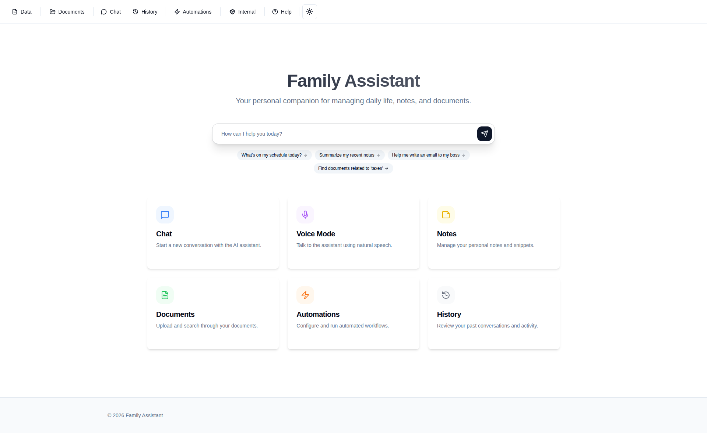
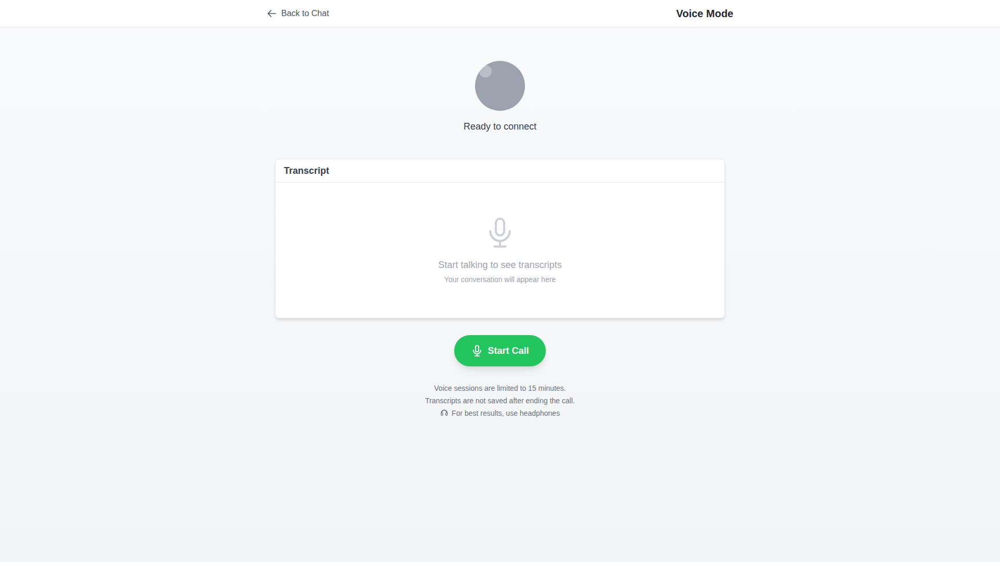

# Family Assistant Feature Overview

This document provides a comprehensive catalog of all features available in Family Assistant. Each
section describes what the feature does, when to use it, and links to detailed documentation.

## Introduction

Family Assistant is an AI-powered personal assistant designed to help manage family information,
schedules, and home automation. It provides a conversational interface through Telegram and the web,
allowing you to interact naturally to accomplish a wide variety of tasks.

**Quick Links:**

- [Quick Start Guide](QUICK_START.md) - Get started in 5 minutes
- [User Guide](USER_GUIDE.md) - Complete feature documentation
- [Scheduling Guide](scheduling.md) - Reminders and recurring tasks
- [Scripting Guide](scripting.md) - Advanced automation

______________________________________________________________________

## Core Features

These features are always available and form the foundation of the assistant.

### Notes Management

Store and retrieve information using a flexible notes system. Notes persist across conversations and
can be automatically included in the assistant's context.

**Capabilities:**

- Create, update, and delete notes with titles and content
- Append content to existing notes instead of replacing
- Control which notes are included in the assistant's context
- Attach files and images to notes
- Automatic indexing for semantic search
- List all notes or retrieve specific notes by title

**Example Commands:**

- "Remember: The Wi-Fi password is BlueOcean2024"
- "Add a note titled 'Shopping List' with milk, eggs, and bread"
- "What was the plumber's number?"
- "List all my notes"
- "Delete the note 'Old Shopping List'"

**Documentation:**
[User Guide - Managing Notes](USER_GUIDE.md#3-what-can-the-assistant-do-for-you-core-features)

______________________________________________________________________

### Calendar and Events

Manage your schedule through natural language interactions with connected CalDAV calendars.

**Capabilities:**

- Add new events with dates, times, and details
- Search for existing events by date range or keywords
- Modify event times, titles, and details
- Delete events (with confirmation)
- View upcoming events for specific time periods
- Duplicate event detection to prevent accidental duplicates

**Example Commands:**

- "Add dentist appointment for next Tuesday at 2pm"
- "What's on my calendar tomorrow?"
- "Change the team lunch to 12:30 PM"
- "Delete the meeting on Friday"
- "Show me all events this week"

**Requirements:** CalDAV calendar connection (Google Calendar, iCloud, etc.)

**Documentation:**
[User Guide - Calendar](USER_GUIDE.md#3-what-can-the-assistant-do-for-you-core-features)

______________________________________________________________________

### Reminders and Scheduled Tasks

Schedule reminders, callbacks, and automated actions to run at specific times or on recurring
schedules.

**Capabilities:**

- Simple time-based reminders with optional follow-ups
- One-time callbacks to continue conversations later
- Recurring tasks using RRULE format (daily, weekly, monthly, etc.)
- Scheduled script execution for automated workflows
- View, modify, and cancel pending tasks

**Example Commands:**

- "Remind me to call Mom at 5pm"
- "Set a reminder for tomorrow at 3pm to pick up groceries"
- "Send me a weather update every morning at 7am"
- "Schedule a script to clean up old notes every Sunday"
- "Show me my pending callbacks"
- "Cancel the daily weather update"

**Documentation:** [Scheduling Guide](scheduling.md)

______________________________________________________________________

### Document Search

Search across all stored documents, notes, emails, and files using semantic and keyword matching.

**Capabilities:**

- Semantic search using AI embeddings
- Filter by source type (email, note, PDF, etc.)
- Retrieve full document content
- Access original file attachments (PDFs, images)
- Search indexed web pages

**Example Commands:**

- "Search my notes for 'project deadline'"
- "Find emails about the flight booking"
- "Look for PDF documents related to insurance"
- "Show me the full content of document 123"

**Documentation:**
[User Guide - Search Documents](USER_GUIDE.md#3-what-can-the-assistant-do-for-you-core-features)

______________________________________________________________________

## Communication

Features for interacting with the assistant and other users.

### Telegram Integration

Primary interface for interacting with the assistant through the Telegram messaging app.

**Capabilities:**

- Natural conversation with the assistant
- Send images and files for analysis
- Receive reminders and notifications
- Use slash commands for specialized modes
- Reply to messages to maintain context
- Inline confirmation buttons for important actions

**Slash Commands:**

| Command      | Purpose                              |
| ------------ | ------------------------------------ |
| `/browse`    | Complex web interactions             |
| `/research`  | In-depth research on a topic         |
| `/visualize` | Create charts and graphs from data   |
| `/automate`  | Create automated triggers            |
| `/artist`    | Generate or manipulate images/videos |
| `/camera`    | Investigate camera footage           |

**Documentation:**
[User Guide - Getting Started](USER_GUIDE.md#2-getting-started-how-to-talk-to-the-assistant)

______________________________________________________________________

### Web Interface

A responsive web application for interacting with the assistant and managing your data.

**Capabilities:**

- Real-time chat with streaming responses
- View and manage notes
- Browse and search documents
- View conversation history across all interfaces
- Manage background tasks
- Upload documents for indexing
- Manage API tokens
- Create and edit automations
- Dark mode support
- Mobile-optimized design

 *The web interface
provides a centralized dashboard for all assistant features*

**Documentation:** [User Guide - Web Interface](USER_GUIDE.md#7-using-the-web-interface)

______________________________________________________________________

### Push Notifications

Receive push notifications on your devices for important updates and reminders.

**Capabilities:**

- Browser push notifications (PWA)
- Notification for scheduled reminders
- Alerts from automations
- Event-triggered notifications

**Requirements:** VAPID keys configured, browser with push notification support

______________________________________________________________________

### Send Messages to Other Users

Send messages to other known users in the system.

**Capabilities:**

- Send text messages to other family members
- Forward attachments to other users
- Confirmation before sending to prevent accidental messages

**Example Commands:**

- "Tell Alice that dinner is ready"
- "Send this photo to John"

______________________________________________________________________

## Smart Home (Home Assistant)

Integration with Home Assistant for home automation and monitoring. **Requires Home Assistant
configuration.**

### Device Control

Control smart home devices through natural language.

**Capabilities:**

- Turn devices on/off
- Adjust settings (thermostat temperature, dimmer levels)
- Check device status
- Query sensor values
- Execute Home Assistant services

**Example Commands:**

- "Turn on the kitchen lights"
- "Is the garage door closed?"
- "Set the thermostat to 70 degrees"
- "What's the temperature in the baby's room?"

**Requirements:** Home Assistant integration configured

______________________________________________________________________

### Location Tracking

Track the location of family members using Home Assistant's person entities.

**Capabilities:**

- Know who is home and who is away
- Calculate distances to known locations (work, school)
- Track detailed location information when available
- Get ETA for family members

**Requirements:** Home Assistant with device trackers configured

______________________________________________________________________

### Camera Snapshots

Retrieve snapshots from Home Assistant cameras.

**Capabilities:**

- Get current camera snapshots
- View camera feeds through the assistant
- Analyze camera images with AI

**Example Commands:**

- "Show me the front door camera"
- "Is anyone at the front porch?"

**Requirements:** Cameras configured in Home Assistant

______________________________________________________________________

### State History

Download and analyze historical data from Home Assistant sensors.

**Capabilities:**

- Retrieve historical state data for any entity
- Export data as JSON for analysis
- Create visualizations from sensor data
- Track patterns over time

**Example Commands:**

- "Show me the pool temperature over the last 5 days"
- "Download the thermostat history for this week"

**Requirements:** Home Assistant integration configured

______________________________________________________________________

### Event Monitoring

Watch for specific events and get notified or trigger automations.

**Capabilities:**

- Monitor state changes
- Detect zone entry/exit
- Watch for sensor threshold crossings
- Custom event filtering

**Documentation:**
[User Guide - Event Monitoring](USER_GUIDE.md#3-what-can-the-assistant-do-for-you-core-features)

______________________________________________________________________

## Security Cameras

Advanced camera integration for security and investigation. **Requires camera backend
configuration.**

### Camera Investigation

Search and analyze security camera footage using AI.

**Capabilities:**

- List all configured cameras
- Search for AI detection events (person, vehicle, pet, motion)
- Extract frames from specific timestamps
- Batch frame extraction for visual analysis
- View recording periods

**Slash Command:** `/camera` or `/investigate`

**Example Commands:**

- "What happened in the backyard yesterday afternoon?"
- "Show me motion events from the garage camera"
- "Were there any visitors at the front door today?"

**Requirements:** Reolink or compatible camera backend configured

**Documentation:** See config.yaml for camera_analyst profile

______________________________________________________________________

## Media and Creative

Features for generating and manipulating media content. **Some features require specific API keys.**

### Image Generation

Create images from text descriptions using AI.

**Capabilities:**

- Generate images from detailed text prompts
- Multiple style options (photorealistic, artistic, auto)
- High-quality output for various use cases

**Slash Command:** `/artist` or `/image`

**Example Commands:**

- "Generate an image of a mountain sunset"
- "Create a photorealistic image of a cozy cabin in the woods"

**Requirements:** Gemini API key

______________________________________________________________________

### Image Transformation

Edit and transform existing images using AI.

**Capabilities:**

- Remove objects from images
- Change styles (make it look like a painting)
- Create variations (same scene at night)
- Apply artistic effects

**Example Commands:**

- "Remove the person from this photo"
- "Make this image look like an oil painting"

**Requirements:** Gemini API key

______________________________________________________________________

### Image Annotation

Highlight and annotate specific areas in images.

**Capabilities:**

- Draw attention to specific regions
- Add visual markers to images
- Create annotated versions for explanation

______________________________________________________________________

### Video Generation

Create short videos from text descriptions using Google's Veo model.

**Capabilities:**

- Generate 4-8 second videos from text prompts
- Support for various aspect ratios (16:9, 9:16)
- Reference images for style/content guidance
- Image-to-video animation
- Interpolation between keyframes
- Audio cues in prompts

**Slash Command:** `/artist` or `/video`

**Example Commands:**

- "Generate a video of a futuristic city with flying cars"
- "Create a video of ocean waves crashing on rocks"
- "Make a 4-second video of a puppy playing"

**Requirements:** Gemini API key with Veo access

**Documentation:**
[User Guide - Video Generation](USER_GUIDE.md#3-what-can-the-assistant-do-for-you-core-features)

______________________________________________________________________

## Research and Browsing

Features for gathering information from the web.

### Web Browsing

Full browser automation for complex web interactions.

**Capabilities:**

- Navigate websites and fill forms
- Interact with JavaScript-heavy pages
- Handle login flows and multi-step processes
- Take screenshots during browsing
- Extract information from dynamic pages

**Slash Command:** `/browse`

**Example Commands:**

- "/browse Fill out the registration form at example.com"
- "/browse Find travel options to Paris for June"
- "/browse Compare prices on this shopping site"

**Note:** For simple page summaries, the assistant can often fetch content directly without the
browse command.

______________________________________________________________________

### Deep Research

In-depth research using Google's Gemini Deep Research agent.

**Capabilities:**

- Comprehensive information gathering
- Multi-source analysis
- Detailed research reports
- Academic and professional research

**Slash Command:** `/research`

**Example Commands:**

- "/research Tell me about the history of Python programming"
- "/research What are the latest developments in renewable energy?"
- "/research Compare different project management methodologies"

______________________________________________________________________

### Document Ingestion

Ingest documents from URLs for later search and reference.

**Capabilities:**

- Fetch and index web pages
- Extract text from PDFs
- Automatic title extraction
- Semantic search of ingested content

**Example Commands:**

- "Save this page for later: https://example.com/article"
- "Index this article: https://example.com with title 'My Article'"

______________________________________________________________________

## Automation

Features for creating automated workflows and triggers.

### Event-Based Automations

Create automations that trigger when specific events occur.

**Capabilities:**

- Watch for Home Assistant events
- Monitor document indexing
- Custom event matching with conditions
- Condition scripts for complex logic
- Actions: Wake LLM or run scripts

**Slash Command:** `/automate`

**Example Commands:**

- "Alert me when the garage door opens after 10pm"
- "Notify me when Alex arrives home"
- "Watch for any new documents about invoices"

**Documentation:**
[User Guide - Automations](USER_GUIDE.md#3-what-can-the-assistant-do-for-you-core-features)

______________________________________________________________________

### Schedule-Based Automations

Create automations that run on a recurring schedule.

**Capabilities:**

- RRULE-based scheduling (daily, weekly, monthly, etc.)
- One-time scheduled actions
- Script execution on schedule
- LLM callbacks on schedule

**Example Commands:**

- "Send me a daily briefing every morning at 8am"
- "Run a cleanup script every Sunday at midnight"
- "Check for updates every hour"

**Documentation:** [Scheduling Guide](scheduling.md)

______________________________________________________________________

### Scripting

Write custom automation scripts using Starlark for complex workflows.

**Capabilities:**

- Access to all assistant tools from scripts
- Time and date manipulation
- JSON processing
- Attachment creation and manipulation
- Event-triggered script execution
- 10-minute execution timeout

**Example Use Cases:**

- Summarize all TODO notes
- Create prep notes for upcoming meetings
- Process and filter data
- Automated reporting

**Documentation:** [Scripting Guide](scripting.md)

______________________________________________________________________

### Automation Management

Manage all your automations through conversation or the web UI.

**Capabilities:**

- List all automations
- View automation details and history
- Enable/disable automations
- Edit automation conditions and scripts
- View execution statistics
- Delete automations

**Example Commands:**

- "List all my automations"
- "Disable the garage door alert"
- "Show me the script for my temperature automation"

______________________________________________________________________

## Data and Visualization

Features for working with data and creating visualizations.

### Data Visualization

Create professional charts and graphs from your data.

**Capabilities:**

- Vega/Vega-Lite specification support
- Bar charts, line graphs, scatter plots
- Pie charts, area charts
- Time series visualizations
- Data from CSV, JSON, or inline
- Integration with Home Assistant data

**Slash Command:** `/visualize` or `/chart`

**Example Commands:**

- "/visualize Create a bar chart showing sales by month from this CSV"
- "/chart Generate a line graph of temperature trends"
- "/visualize Show the distribution of categories in this dataset"

**Documentation:** [Data Visualization Guide](data_visualization.md)

______________________________________________________________________

### Data Manipulation (jq)

Process and transform JSON data using jq queries.

**Capabilities:**

- Filter and select data
- Transform data structures
- Aggregate and summarize
- Chain with visualization tools

**Use Cases:**

- Clean sensor data before visualization
- Extract specific fields from large datasets
- Filter events by criteria

**Documentation:**
[Data Visualization Guide - Data Cleaning](data_visualization.md#best-practices-for-data-cleaning)

______________________________________________________________________

## Additional Features

### Voice Interface

Interact with the assistant using voice through the Gemini Live API.

**Capabilities:**

- Real-time voice conversation
- Automatic speech detection
- Voice activity detection (VAD)
- Configurable voices
- Telephone integration (Asterisk)

 *The voice interface enables real-time voice
conversations with the assistant*

**Requirements:** Gemini API key with Live API access

______________________________________________________________________

### Service Delegation

Delegate tasks to specialized assistant profiles.

**Capabilities:**

- Switch between profiles mid-conversation
- Access specialized tools for specific tasks
- Security levels for delegation control

______________________________________________________________________

### Photo Analysis

Send photos for the assistant to analyze and answer questions about.

**Capabilities:**

- Image recognition and description
- Text extraction (OCR)
- Object identification
- Question answering about image content

**Example Commands:**

- "What kind of flower is this?" (with attached photo)
- "Can you describe what's in this picture?"
- "Read the text from this document image"

**Documentation:** [User Guide - Attachments](USER_GUIDE.md#4-working-with-attachments)

______________________________________________________________________

### Tool Confirmations

Important actions require your approval before execution.

**Capabilities:**

- Confirmation dialogs for destructive actions
- Approve/Deny buttons in Telegram
- Dialog boxes in web interface
- Full control over assistant actions

**Actions Requiring Confirmation:**

- Calendar modifications and deletions
- Sending messages to other users
- File operations
- Other significant state changes

**Documentation:** [User Guide - Confirmations](USER_GUIDE.md#6-tool-confirmations)

______________________________________________________________________

## Configuration Requirements

Some features require specific configuration. Check with your administrator if these are available:

| Feature               | Requirement                         |
| --------------------- | ----------------------------------- |
| Calendar              | CalDAV connection                   |
| Home Assistant        | Home Assistant URL and token        |
| Security Cameras      | Camera backend (Reolink/Frigate)    |
| Image/Video Gen       | Gemini API key                      |
| Deep Research         | Gemini API key                      |
| Web Browsing          | Playwright installed                |
| Push Notifications    | VAPID keys                          |
| MCP Tools (Maps, etc) | Individual MCP server configuration |

______________________________________________________________________

## Getting Help

- Ask: "What can you help me with?"
- Quick Start: [QUICK_START.md](QUICK_START.md)
- Full Guide: [USER_GUIDE.md](USER_GUIDE.md)
- Contact your Family Assistant administrator for configuration issues
