# Interfaces: Telegram, Web, and iOS

**What's here:** the ways you can talk to the assistant, what each one is good at, and the controls
available while a reply is being generated.

## Telegram (primary)

Find the bot contact in Telegram — whoever set up the assistant will tell you its name — and send
messages as you would to a person.

- **Slash commands** switch the assistant into a specialised mode for a request, for example
  `/browse` for complex web tasks. See [slash-commands.md](slash-commands.md).
- **Reply to a message** using Telegram's reply feature when you're following up on something
  specific. It tells the assistant exactly what you mean, and keeps the conversation in a
  specialised mode if you were using one.
- **Send photos and files** directly in a message, with your question as the caption. A whole album
  is treated as one message, so you get one answer covering all the photos.
- **Follow up mid-reply:** if you send another message while the assistant is still working, it
  folds that into the response it's already preparing.
- **`/interrupt`** stops the request currently being processed in that chat.
- **Confirmations** arrive as inline **✅ Confirm** and **❌ Cancel** buttons. See
  [confirmations-and-safety.md](confirmations-and-safety.md).

## Web interface

Open the web app at the URL your operator gave you (`{{ SERVER_URL }}`). It opens on the chat page,
works on phones and tablets, and supports dark mode.

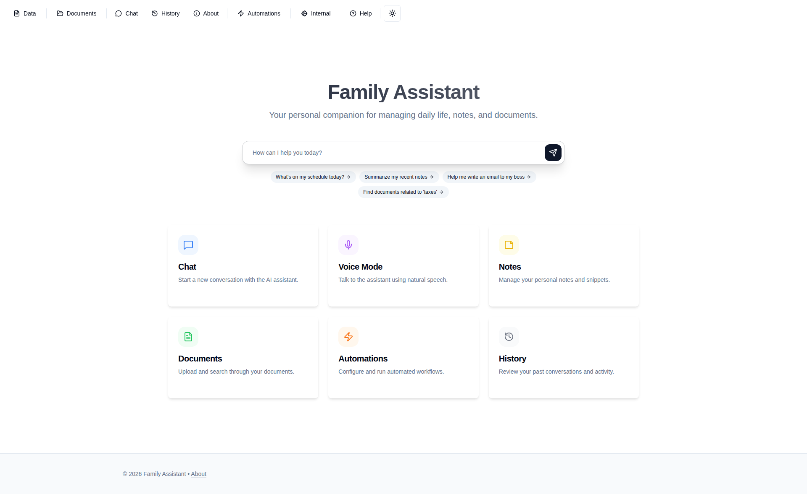 *The landing page gives quick access to
every section*

### Chat

Replies stream in as they're generated, completed tool calls collapse into a compact summary, and
conversations are easy to switch between.

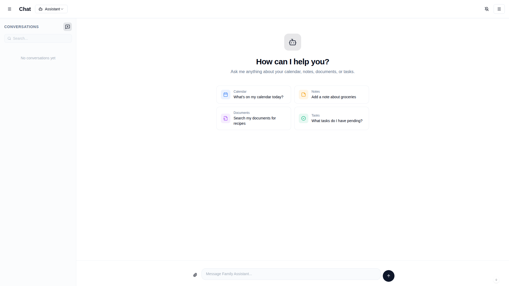 *The web chat interface*

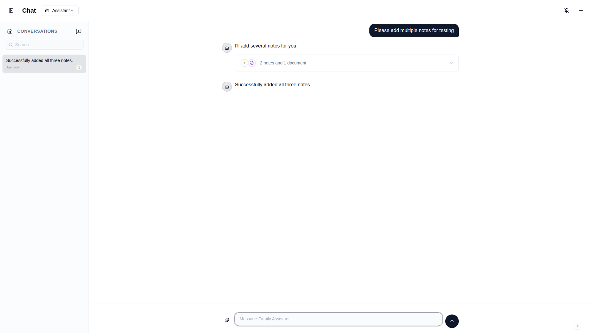 *Completed tool
calls stay collapsed while keeping the details available*

Reopening an existing conversation resumes it under the profile it started in, so follow-ups keep
their context. Starting a new chat uses whichever profile you last picked.

Switching profile part-way through a conversation starts a fresh chat in the new profile, so each
profile's context stays separate — but anything you have already typed comes with you, so you can
draft a message and then decide who should handle it. If the chat is still empty, switching just
changes the profile and keeps you where you are.

**Share a conversation.** Open a conversation that already has messages and select the share icon in
the chat header. The web app copies a link to a read-only transcript; the iOS app opens its share
sheet so you can choose where to send it. The recipient must sign in as an authorized Family
Assistant user, and the conversation does not appear in their history list. On iPhone or iPad with
the Family Assistant app installed, links from `assistant.andrewgarrett.dev` open the transcript in
a native read-only view; pull down to refresh it. Selecting share again replaces the old link;
select the stop-sharing icon to make the current link unavailable. The transcript reflects messages
added after the link was created when the recipient refreshes it. Tool calls appear as collapsed
groups, the same way they do in your own chat; the recipient can expand a group to see what the
assistant ran and what came back.

Treat the link as private within your household. It is meant to stop another authorized user from
casually browsing your history, not to protect a conversation from someone who obtains the link and
deliberately tries to access it.

**Stop or steer a running reply.** While the assistant is generating, the chat box doubles as a
steering box:

- Leave it empty and Send becomes **Stop** — the reply halts immediately and is marked "Stopped".
- Type a course correction ("actually, focus on next week") and the button becomes **Steer** — the
  assistant folds your note into the work it's already doing instead of starting over.

This is the web equivalent of Telegram's `/interrupt` and mid-reply follow-ups. Native iOS Chat has
the same controls.

### Pages

The menu is grouped into **Information**, **Operations**, and **Settings**:

- **Notes** — list, search, edit, and delete notes, and control which ones are included in the
  assistant's context automatically.

  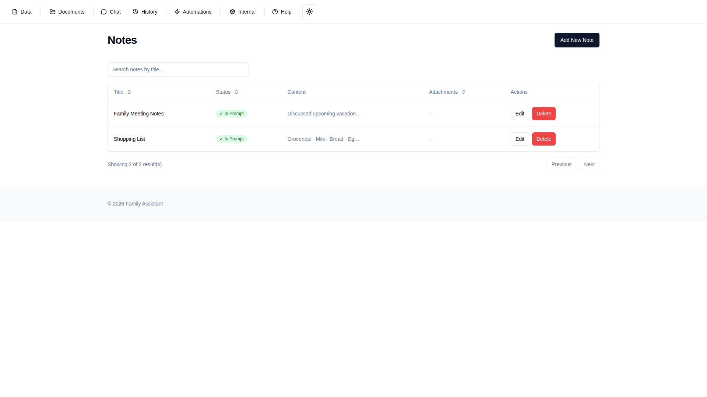
  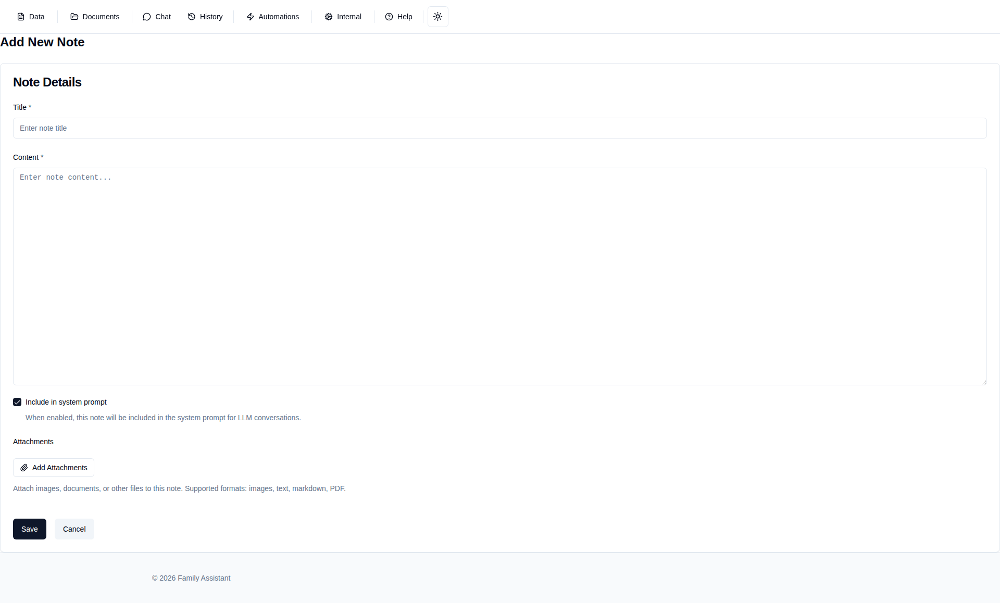

- **Documents** — every indexed document with its type, source, and metadata, linking through to the
  full text.

  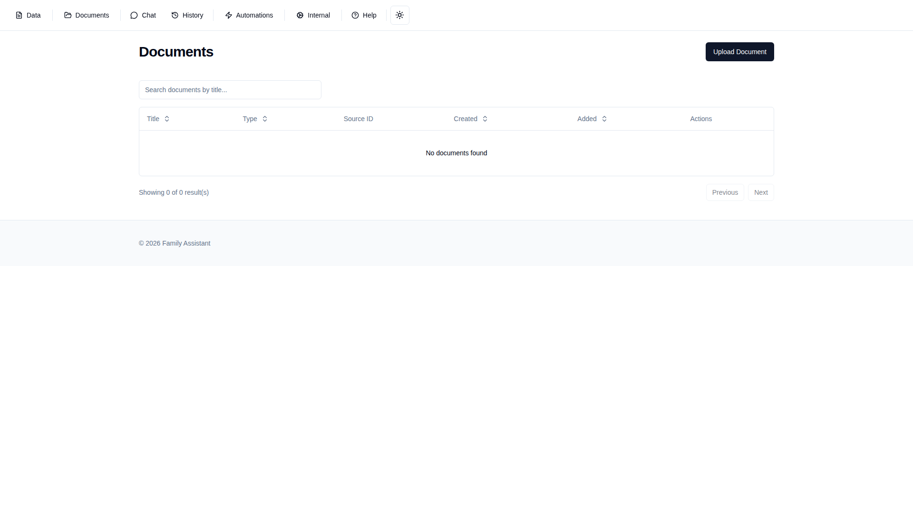

- **Vector Search** — semantic search across notes, emails, uploaded files, and indexed web pages.
  Results are grouped by document, and the detail view shows the full text at the top.

  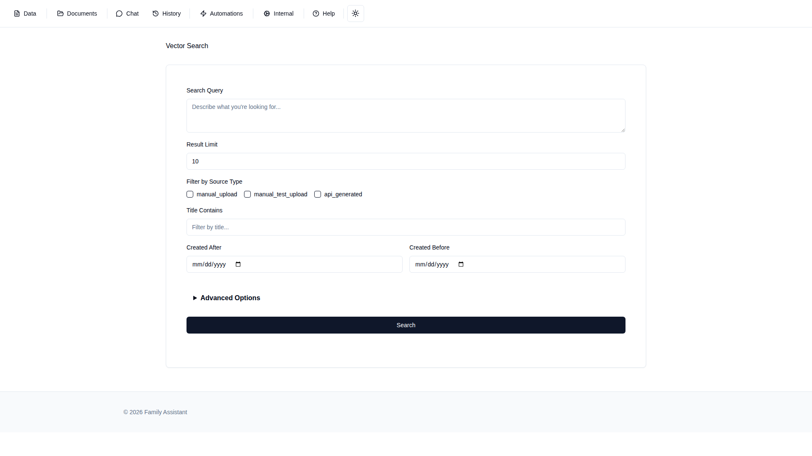

- **Upload Document** — add PDFs, text files, and other documents for indexing.

- **History** — past conversations across Telegram, web, and email, with filtering.

  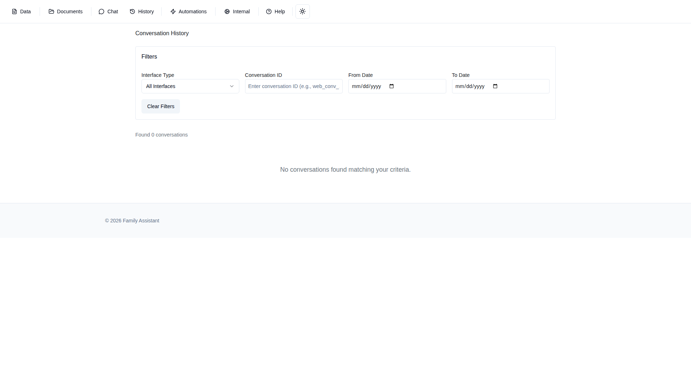

  Each message has a **Message Details** panel you can expand to see which mode answered, how many
  tokens the turn used, and — for models that report it — a **Thinking Summary** of the reasoning
  behind the reply. Not every model publishes a summary, so the panel only appears when one was
  recorded.

- **Tasks** — background and scheduled work, with the option to retry a failed task.

  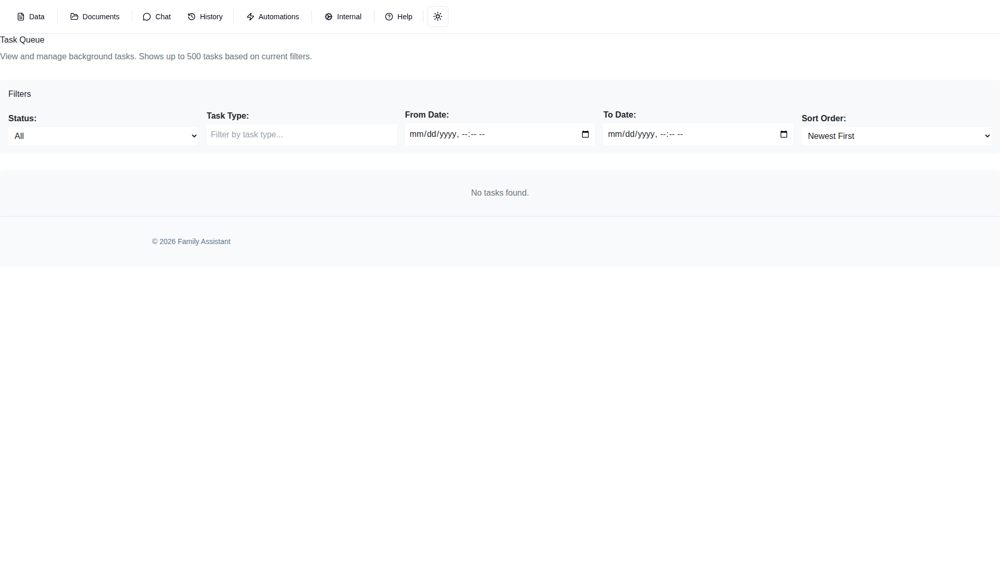

- **Automations** — create automations, review their configuration and run history, and enable,
  disable, or delete them. See [automations.md](automations.md).

  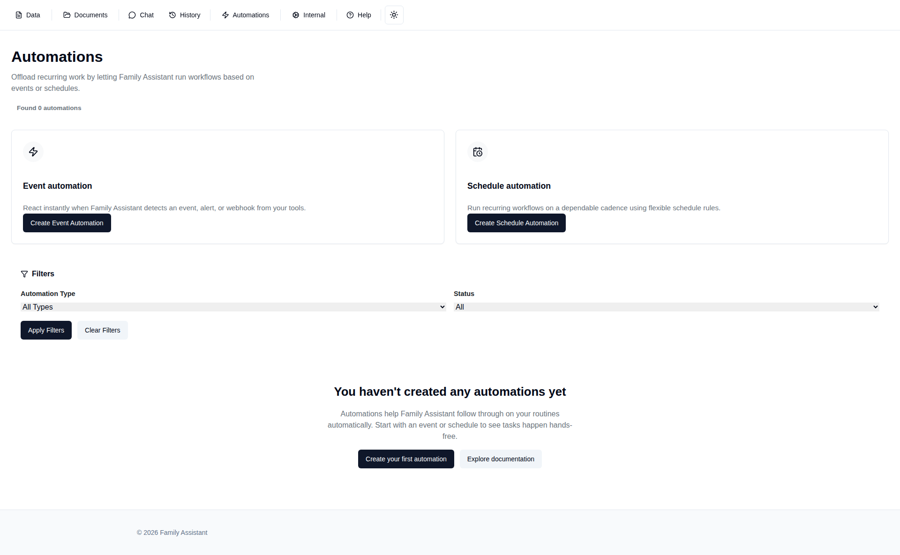

- **Tools** — inspect the available tools and their parameters, and test them directly.

  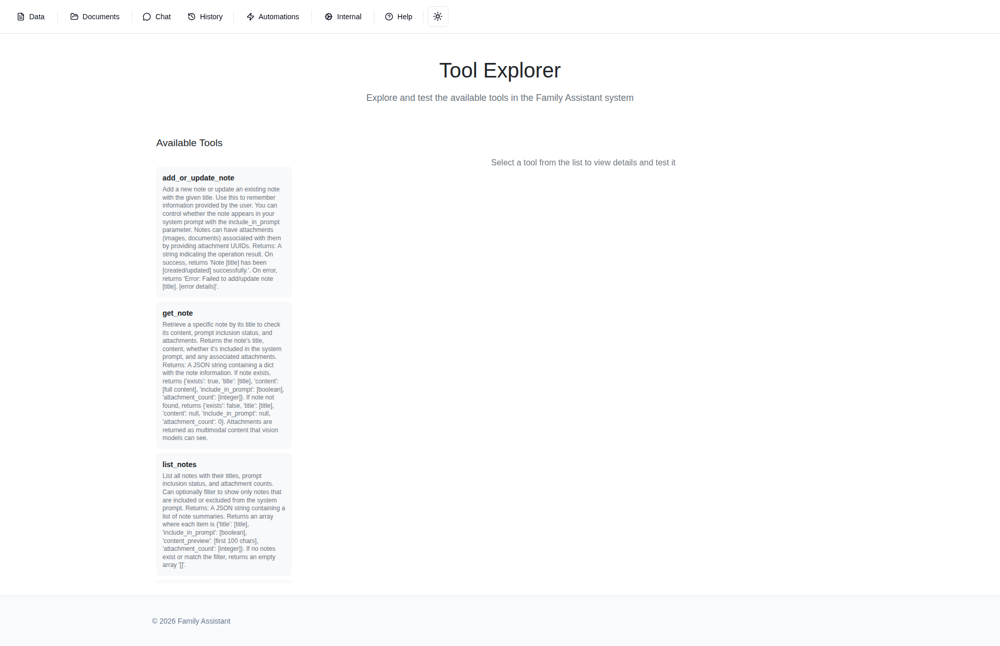

- **Settings → API Tokens** — manage tokens for programmatic access.

  

- **Settings → Connected Accounts** — link your Google account. See
  [google-workspace.md](google-workspace.md).

- **Error Logs** (`/errors`) — where whoever manages the assistant reviews reported problems. See
  [troubleshooting.md](troubleshooting.md).

## iOS app

The native app signs you in securely and opens on five tabs: **Chat**, **Voice**, **Notes**,
**Documents**, and **More**. Chat, Voice, and Notes are native screens; Documents and everything
under More open the corresponding pages in-app. Each tab remembers where you were.

**Chat** shares the same conversation history as the browser. It streams replies, supports stopping
and steering, switches profiles (picking a profile starts a fresh conversation in it, carrying over
anything you have typed and attached; on a chat that is still empty it switches in place; reopening
an older conversation resumes its original profile), renders Markdown and tool calls, handles
approve/reject confirmations, and uploads images, PDFs, plain text, and Markdown up to 100 MB. Very
long messages render a section at a time behind a **Show more** control.

**Getting content in:** share a supported file from the iOS share sheet or Files "Open In" and it
opens a new Chat draft with the file attached. A copied image can be pasted with the paste button
beside the composer. The Photos share sheet does not list Family Assistant — copy the photo and
paste it, use the composer's photo button, or share from Files. Long-pressing the app icon offers
**New Chat** and **Voice** quick actions.

**Voice** asks for microphone permission and shows a level meter while capturing audio.

**Notes** lets you search, read, create, edit, and delete notes, including whether a note is
included in the assistant's context automatically.

**Connection indicator:** a small indicator in the Chat toolbar shows the live-update state and
offers the right fix in one tap — *degraded* (updates lagging, tap to reconnect), *offline* (tap to
reconnect), or *sign-in required* (tap to sign in). Background sync problems surface there rather
than as pop-up dialogs; if the conversation list itself can't refresh, a small "Couldn't refresh —
last updated …" note appears at the top of the list. A failed send shows a **Retry** button on the
message itself; retrying is safe and never sends twice. If Chat says **"authentication wall
detected"**, open your Family Assistant web address in Safari and complete any sign-in page, then
return to the app and tap the connection indicator to reconnect. If Safari cannot reach the sign-in
page either, check your connection and contact the person who manages Family Assistant.

**More** gathers Events, History, Automations, Tools, and a **Settings** screen with notification
controls and sign-out.

### Siri and Shortcuts

The iOS app provides actions you can run from Siri or the **Shortcuts** app with no setup. You must
be signed in first.

- **"Ask Family Assistant…"** — ask a question and get the reply inline. **Continue in app** opens
  the full conversation, which is useful if the assistant needs you to approve something.
- **"Capture this in Family Assistant"** — send text or a link for the assistant to save and file.
  Add it to a Shortcut with *Show in Share Sheet* enabled to capture from Safari, Notes, and other
  apps. Captured pages and emails are outside content, so the assistant handles them in a restricted
  mode: it can read your information to file things sensibly, but asks you to approve any change it
  wants to make.
- **"Add a note to Family Assistant"** — create a note by title and content.
- **"Open Family Assistant chat"** — open on the Chat tab, optionally starting a new conversation
  with a message.

These also appear as building blocks in Shortcuts, so you can combine them with other automations.

## Messaging other people in your household

The assistant can pass a message to another person it knows, in whichever interface they use:

- "Tell Alice that dinner is ready."
- "Let Sam know I'll be twenty minutes late."
- "Send this photo to John."

It tells you what it sent and to whom. In a normal chat it sends straight away, so name the person
clearly. When the request originated somewhere less trusted — a forwarded email, say — it asks you
to approve the message first. See [confirmations-and-safety.md](confirmations-and-safety.md).

This only reaches people set up as users of your Family Assistant — it isn't a way to send ordinary
SMS or email to arbitrary contacts. The assistant can only message someone in a conversation they
have already used to talk to it, so a new household member needs to message the assistant once
before anyone can have a message passed to them.

## Push notifications

The assistant can reach you when the app isn't open.

- **Browser (PWA):** install the web app to your device and allow notifications.
- **iOS app:** notifications are off until you turn them on. Go to **More → Settings** and choose
  **Enable Notifications**, then grant permission when iOS asks. The app registers for Apple push
  notifications only after that.

You're notified when a new assistant reply arrives in a web conversation, a confirmation is waiting
for approval, a background task fails after retrying, a spawned worker task finishes, or a
long-running delegated task completes. Notifications go to every device you've registered.

**If you close the app mid-reply,** processing continues on the server and the finished reply
arrives as a push notification — tap it to jump back to the conversation. (You only get this push if
the connection actually dropped; watching the stream live doesn't produce an extra notification.)

**If the connection drops while a reply is streaming,** the app reconnects and continues the same
reply, or quietly reloads the finished reply from history. Opening a conversation whose reply is
still running — one you started on another device, say — streams it live from that point.

## Email

If your operator has configured it, you can email the assistant or forward mail to it. See
[email.md](email.md).

## Delegation to specialist modes

For work better handled by a specialist — browsing, research, visualisation, complex planning — the
assistant may hand off to another profile. Quick handoffs come back inline. Longer ones return a
`delegation_...` reference and leave the conversation free; when the specialist finishes it wakes
the original assistant, which posts the follow-up in the same conversation. You can ask for the
status of a delegation reference at any time.

Delegations can also be continued, so a specialist keeps its earlier context — useful for a
follow-up question to a previous research delegation.

Files travel with a delegation in both directions. A photo, PDF or spreadsheet from your
conversation can be handed to the specialist to work on, and any file it produces — a chart, a
converted document — comes back attached to the reply in the conversation, ready to open or
download. This works the same way whether the specialist runs here or on another agent elsewhere.
Very large files are the exception: if one is too big to hand over, the assistant tells you rather
than quietly leaving it out.

If the follow-up can't be delivered on the channel you asked from — a result too long for the chat
app to accept, say — the assistant is told so and sends you something that does fit, such as a
shorter summary or a note it saved with the full text. The complete result is kept in the
conversation either way, so you can ask for any part of it.

This is separate from spawned worker tasks, which are isolated coding or computing jobs identified
by worker task IDs.
